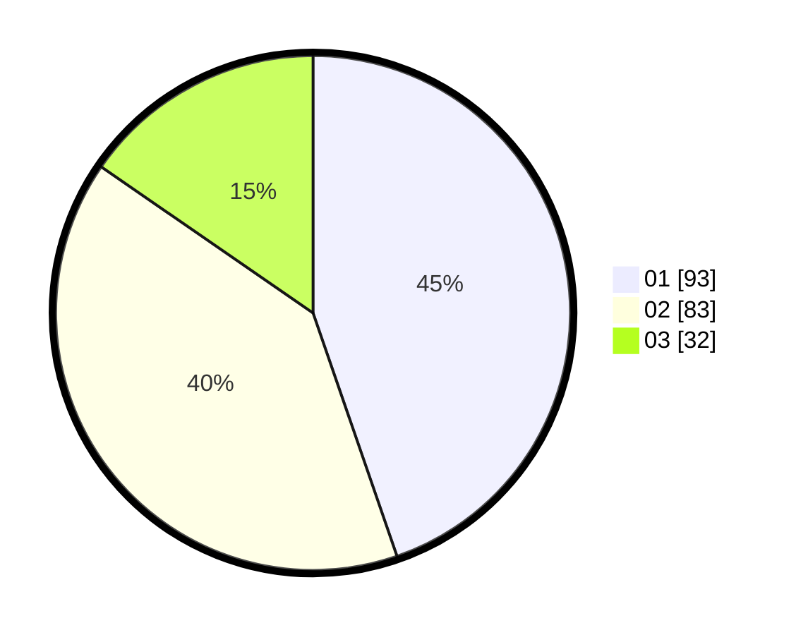

# Hasil

Hasil perolehan suara paslon dapat dilihat pada file paslon-01.txt, paslon-02.txt, dan paslon-03.txt.

Jika tidak ada, artinya data tersebut belum ada pada SIREKAP.

## Perolehan Suara

 * Paslon 01: **93**.
 * Paslon 02: **83**.
 * Paslon 03: **32**.

## Foto C Plano

https://sirekap-obj-formc.kpu.go.id/f307/pemilu/ppwp/31/73/08/10/04/3173081004121-20240216-043004--2fb3077c-817a-4e9a-9ccd-37c2c29b2af1.jpg

https://sirekap-obj-formc.kpu.go.id/f307/pemilu/ppwp/31/73/08/10/04/3173081004121-20240216-040827--40f09772-ce73-4853-ac5d-7f5d3ae06321.jpg

https://sirekap-obj-formc.kpu.go.id/f307/pemilu/ppwp/31/73/08/10/04/3173081004121-20240216-043014--eaabeb4a-024d-437c-a082-439d893188e8.jpg

## DATA PEMILIH TETAP

Jumlah pemilih dalam DPT: **272**.
 * L: **130**.
 * P: **142**.

## DATA PENGGUNA HAK PILIH

Jumlah pengguna hak pilih dalam DPT: **206**.
 * L: **95**.
 * P: **111**.

Jumlah pengguna hak pilih dalam DPTb: **4**.
 * L: **0**.
 * P: **4**.

Jumlah pengguna hak pilih dalam DPK: **0**.
 * L: **0**.
 * P: **0**.

Jumlah pengguna hak pilih: **210**.
 * L: **95**.
 * P: **115**.

## JUMLAH SUARA SAH DAN TIDAK SAH

JUMLAH SELURUH SUARA SAH: **208**.

JUMLAH SUARA TIDAK SAH: **2**.

JUMLAH SELURUH SUARA SAH DAN SUARA TIDAK SAH: **210**.
