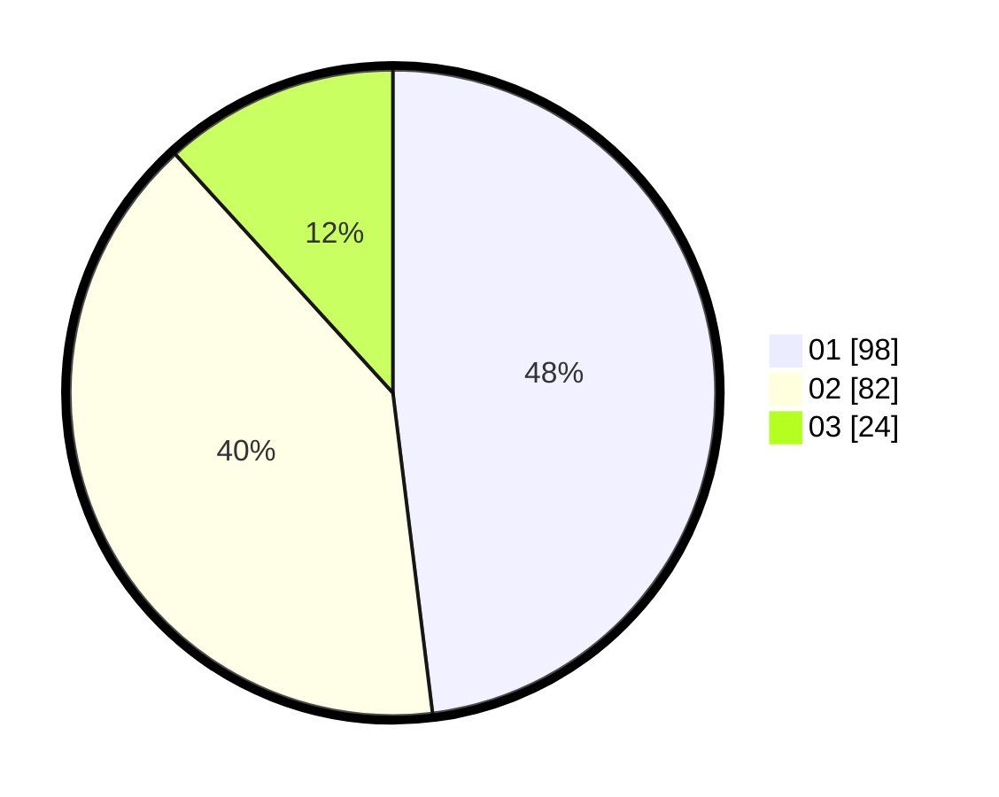

# Hasil

Hasil perolehan suara paslon dapat dilihat pada file paslon-01.txt, paslon-02.txt, dan paslon-03.txt.

Jika tidak ada, artinya data tersebut belum ada pada SIREKAP.

## Perolehan Suara

 * Paslon 01: **98**.
 * Paslon 02: **82**.
 * Paslon 03: **24**.

## Foto C Plano

https://sirekap-obj-formc.kpu.go.id/425d/pemilu/ppwp/31/73/08/10/04/3173081004123-20240215-000231--ab339c2c-c2fe-4fd3-878c-39c0f4f48a9c.jpg

https://sirekap-obj-formc.kpu.go.id/425d/pemilu/ppwp/31/73/08/10/04/3173081004123-20240215-102823--659a5558-b62b-460e-bc45-4737b0e55890.jpg

https://sirekap-obj-formc.kpu.go.id/425d/pemilu/ppwp/31/73/08/10/04/3173081004123-20240215-030859--ce9622f5-56db-48cc-b8a4-7b6f6e989af9.jpg

## DATA PEMILIH TETAP

Jumlah pemilih dalam DPT: **203**.
 * L: **103**.
 * P: **100**.

## DATA PENGGUNA HAK PILIH

Jumlah pengguna hak pilih dalam DPT: **203**.
 * L: **103**.
 * P: **100**.

Jumlah pengguna hak pilih dalam DPTb: **4**.
 * L: **2**.
 * P: **2**.

Jumlah pengguna hak pilih dalam DPK: **0**.
 * L: **0**.
 * P: **0**.

Jumlah pengguna hak pilih: **207**.
 * L: **105**.
 * P: **102**.

## JUMLAH SUARA SAH DAN TIDAK SAH

JUMLAH SELURUH SUARA SAH: **204**.

JUMLAH SUARA TIDAK SAH: **3**.

JUMLAH SELURUH SUARA SAH DAN SUARA TIDAK SAH: **207**.
