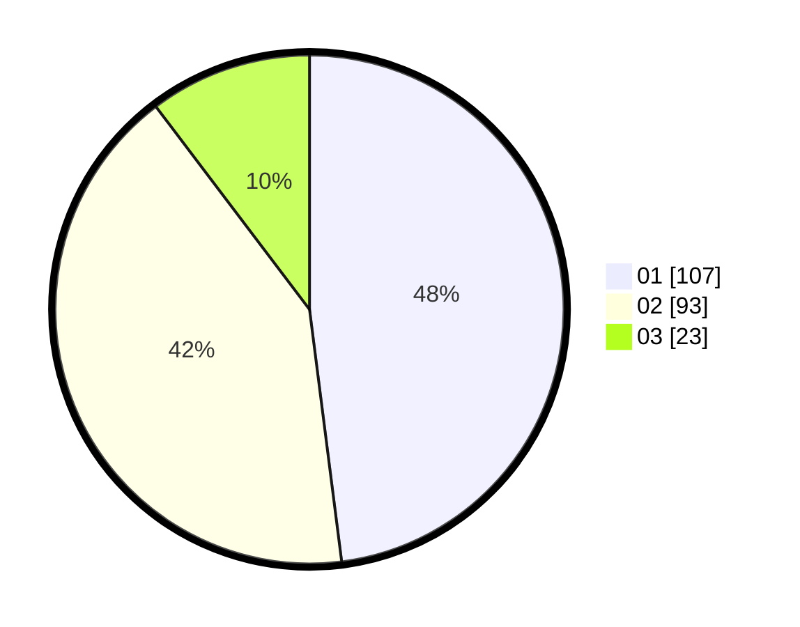

# Hasil

Hasil perolehan suara paslon dapat dilihat pada file paslon-01.txt, paslon-02.txt, dan paslon-03.txt.

Jika tidak ada, artinya data tersebut belum ada pada SIREKAP.

## Perolehan Suara

 * Paslon 01: **107**.
 * Paslon 02: **93**.
 * Paslon 03: **23**.

## Foto C Plano

https://sirekap-obj-formc.kpu.go.id/d1c7/pemilu/ppwp/31/73/08/10/04/3173081004125-20240214-155424--1a3aebb5-7c5d-4509-b39e-d6dd12457dec.jpg

https://sirekap-obj-formc.kpu.go.id/d1c7/pemilu/ppwp/31/73/08/10/04/3173081004125-20240214-155528--03400b7c-d864-43d7-abc6-7d7962d15fa9.jpg

https://sirekap-obj-formc.kpu.go.id/d1c7/pemilu/ppwp/31/73/08/10/04/3173081004125-20240214-222915--061f9960-f593-46f5-a236-0f1a2cfe2b3c.jpg
