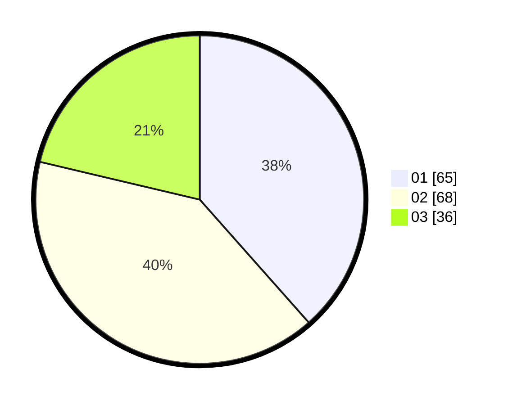

# Hasil

Hasil perolehan suara paslon dapat dilihat pada file paslon-01.txt, paslon-02.txt, dan paslon-03.txt.

Jika tidak ada, artinya data tersebut belum ada pada SIREKAP.

## Perolehan Suara

 * Paslon 01: **65**.
 * Paslon 02: **68**.
 * Paslon 03: **36**.

## Foto C Plano

https://sirekap-obj-formc.kpu.go.id/cb81/pemilu/ppwp/31/73/08/10/04/3173081004126-20240216-114413--4d0ed3f4-4369-462d-8660-9ff8d1647ce8.jpg

https://sirekap-obj-formc.kpu.go.id/cb81/pemilu/ppwp/31/73/08/10/04/3173081004126-20240216-114406--54339e79-42c0-4e06-b0ff-ea6c1de775b1.jpg

https://sirekap-obj-formc.kpu.go.id/cb81/pemilu/ppwp/31/73/08/10/04/3173081004126-20240216-114324--26606812-ea44-435f-908d-501568c20f2e.jpg

## DATA PEMILIH TETAP

Jumlah pemilih dalam DPT: **228**.
 * L: **105**.
 * P: **123**.

## DATA PENGGUNA HAK PILIH

Jumlah pengguna hak pilih dalam DPT: **162**.
 * L: **70**.
 * P: **92**.

Jumlah pengguna hak pilih dalam DPTb: **6**.
 * L: **3**.
 * P: **3**.

Jumlah pengguna hak pilih dalam DPK: **1**.
 * L: **1**.
 * P: **0**.

Jumlah pengguna hak pilih: **169**.
 * L: **74**.
 * P: **95**.

## JUMLAH SUARA SAH DAN TIDAK SAH

JUMLAH SELURUH SUARA SAH: **169**.

JUMLAH SUARA TIDAK SAH: **0**.

JUMLAH SELURUH SUARA SAH DAN SUARA TIDAK SAH: **169**.
