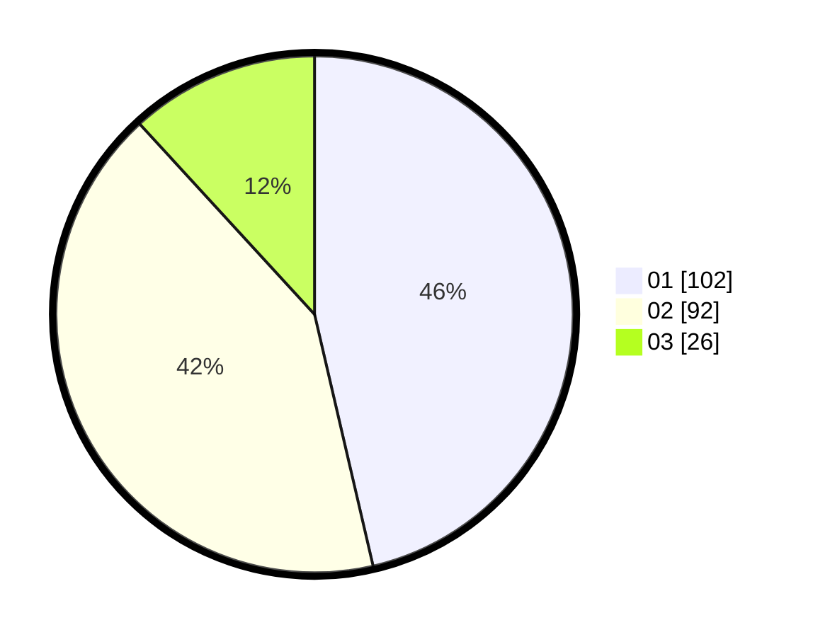

# Hasil

Hasil perolehan suara paslon dapat dilihat pada file paslon-01.txt, paslon-02.txt, dan paslon-03.txt.

Jika tidak ada, artinya data tersebut belum ada pada SIREKAP.

## Perolehan Suara

 * Paslon 01: **102**.
 * Paslon 02: **92**.
 * Paslon 03: **26**.

## Foto C Plano

https://sirekap-obj-formc.kpu.go.id/d1d4/pemilu/ppwp/31/73/08/10/04/3173081004128-20240214-202940--7843f106-56ea-4271-83a6-dbe3f6ca3f59.jpg

https://sirekap-obj-formc.kpu.go.id/d1d4/pemilu/ppwp/31/73/08/10/04/3173081004128-20240214-203238--02b744f4-fb2a-4fb9-989c-5cd8fab1b041.jpg

https://sirekap-obj-formc.kpu.go.id/d1d4/pemilu/ppwp/31/73/08/10/04/3173081004128-20240214-203451--9892d65a-b9be-4703-9d0a-5ce953bfc1f5.jpg

## DATA PEMILIH TETAP

Jumlah pemilih dalam DPT: **271**.
 * L: **135**.
 * P: **136**.

## DATA PENGGUNA HAK PILIH

Jumlah pengguna hak pilih dalam DPT: **217**.
 * L: **106**.
 * P: **111**.

Jumlah pengguna hak pilih dalam DPTb: **1**.
 * L: **0**.
 * P: **1**.

Jumlah pengguna hak pilih dalam DPK: **2**.
 * L: **1**.
 * P: **1**.

Jumlah pengguna hak pilih: **220**.
 * L: **107**.
 * P: **113**.

## JUMLAH SUARA SAH DAN TIDAK SAH

JUMLAH SELURUH SUARA SAH: **220**.

JUMLAH SUARA TIDAK SAH: **2**.

JUMLAH SELURUH SUARA SAH DAN SUARA TIDAK SAH: **222**.
