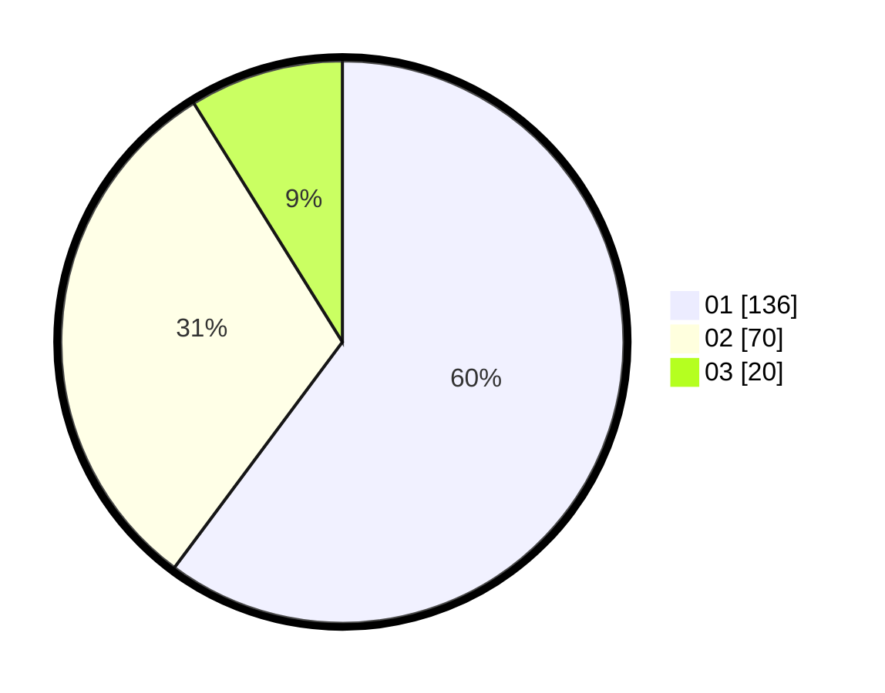

# Hasil

Hasil perolehan suara paslon dapat dilihat pada file paslon-01.txt, paslon-02.txt, dan paslon-03.txt.

Jika tidak ada, artinya data tersebut belum ada pada SIREKAP.

## Perolehan Suara

 * Paslon 01: **136**.
 * Paslon 02: **70**.
 * Paslon 03: **20**.

## Foto C Plano

https://sirekap-obj-formc.kpu.go.id/9e92/pemilu/ppwp/31/73/08/10/04/3173081004139-20240216-095333--afdc4fd5-9dc0-4a7c-9c10-a6f0b32298c1.jpg

https://sirekap-obj-formc.kpu.go.id/9e92/pemilu/ppwp/31/73/08/10/04/3173081004139-20240216-095346--28c791e2-0b1e-4743-9114-25d3b4c9e9bc.jpg
