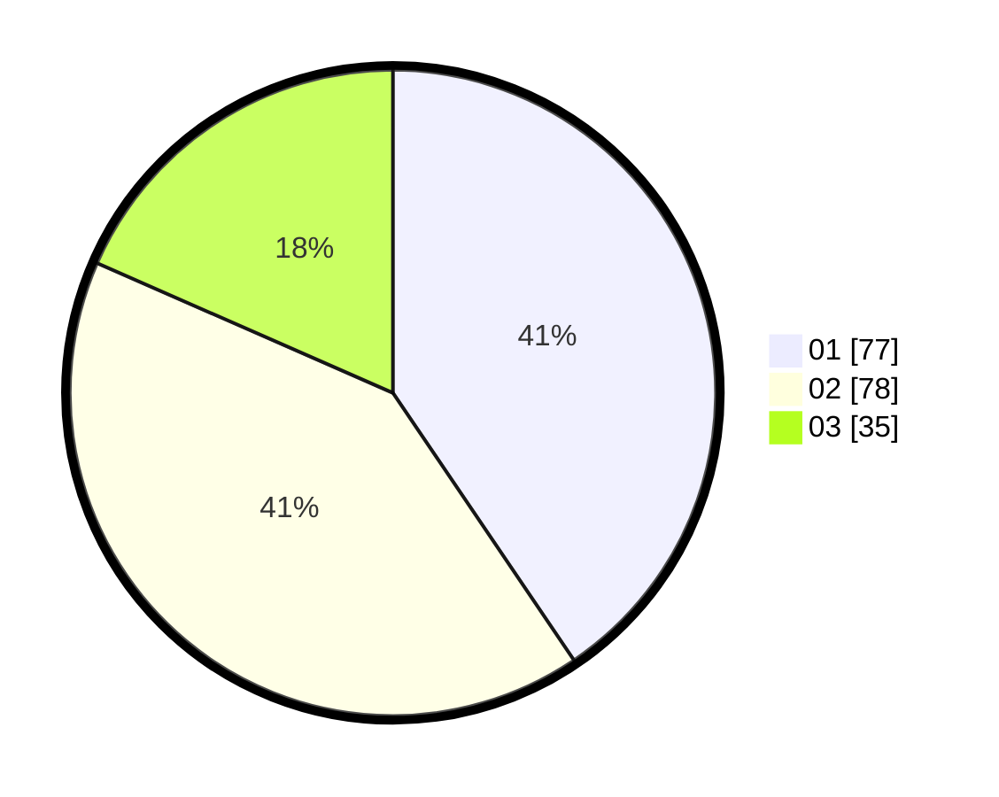

# Hasil

Hasil perolehan suara paslon dapat dilihat pada file paslon-01.txt, paslon-02.txt, dan paslon-03.txt.

Jika tidak ada, artinya data tersebut belum ada pada SIREKAP.

## Perolehan Suara

 * Paslon 01: **77**.
 * Paslon 02: **78**.
 * Paslon 03: **35**.

## Foto C Plano

https://sirekap-obj-formc.kpu.go.id/bb46/pemilu/ppwp/31/73/08/10/04/3173081004144-20240214-233251--cb3afd14-a7cc-4eaa-aef8-74f44c76a2e2.jpg

https://sirekap-obj-formc.kpu.go.id/bb46/pemilu/ppwp/31/73/08/10/04/3173081004144-20240214-233357--1c27255a-1888-49cd-85ab-5769c33c04b8.jpg

https://sirekap-obj-formc.kpu.go.id/bb46/pemilu/ppwp/31/73/08/10/04/3173081004144-20240214-233446--27afe6fb-eecb-442b-ab32-68be240ba957.jpg
