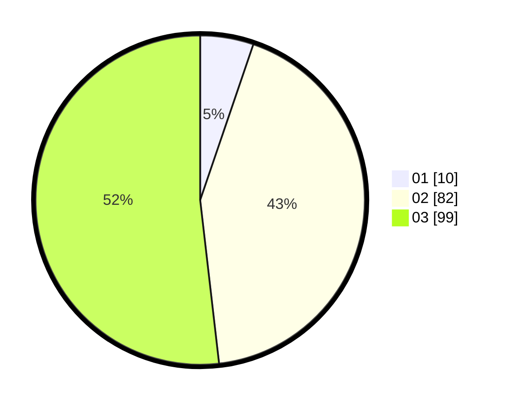

# Hasil

Hasil perolehan suara paslon dapat dilihat pada file paslon-01.txt, paslon-02.txt, dan paslon-03.txt.

Jika tidak ada, artinya data tersebut belum ada pada SIREKAP.

## Perolehan Suara

 * Paslon 01: **10**.
 * Paslon 02: **82**.
 * Paslon 03: **99**.

## Foto C Plano

https://sirekap-obj-formc.kpu.go.id/3c1f/pemilu/ppwp/31/73/08/10/04/3173081004146-20240214-221802--9a97ce34-8add-477d-bc4d-b64caa62b1f5.jpg

https://sirekap-obj-formc.kpu.go.id/3c1f/pemilu/ppwp/31/73/08/10/04/3173081004146-20240217-130154--9c680052-b281-430d-ad74-ed961065f56e.jpg

https://sirekap-obj-formc.kpu.go.id/3c1f/pemilu/ppwp/31/73/08/10/04/3173081004146-20240217-125257--9fc42d5a-a633-43b0-8541-00089d82138f.jpg

## DATA PEMILIH TETAP

Jumlah pemilih dalam DPT: **264**.
 * L: **122**.
 * P: **142**.

## DATA PENGGUNA HAK PILIH

Jumlah pengguna hak pilih dalam DPT: **170**.
 * L: **75**.
 * P: **95**.

Jumlah pengguna hak pilih dalam DPTb: **14**.
 * L: **8**.
 * P: **6**.

Jumlah pengguna hak pilih dalam DPK: **7**.
 * L: **4**.
 * P: **3**.

Jumlah pengguna hak pilih: **191**.
 * L: **87**.
 * P: **104**.

## JUMLAH SUARA SAH DAN TIDAK SAH

JUMLAH SELURUH SUARA SAH: **191**.

JUMLAH SUARA TIDAK SAH: **0**.

JUMLAH SELURUH SUARA SAH DAN SUARA TIDAK SAH: **191**.
