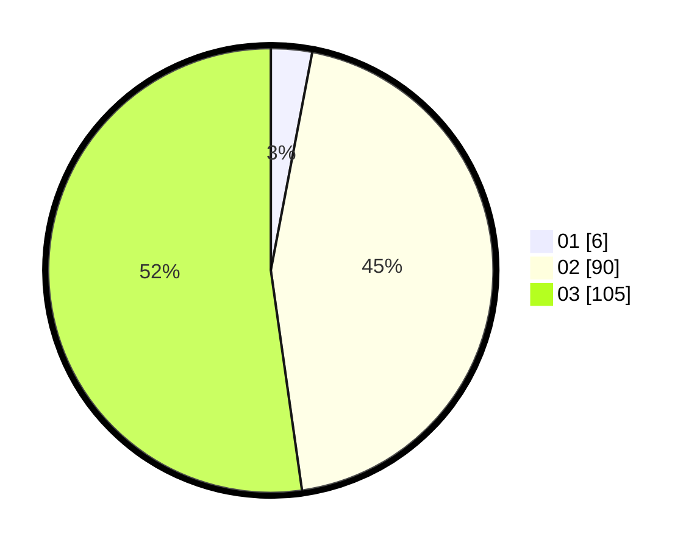

# Hasil

Hasil perolehan suara paslon dapat dilihat pada file paslon-01.txt, paslon-02.txt, dan paslon-03.txt.

Jika tidak ada, artinya data tersebut belum ada pada SIREKAP.

## Perolehan Suara

 * Paslon 01: **6**.
 * Paslon 02: **90**.
 * Paslon 03: **105**.

## Foto C Plano

https://sirekap-obj-formc.kpu.go.id/782f/pemilu/ppwp/31/73/08/10/04/3173081004147-20240214-201715--075f4f0b-cef3-475e-a12e-b2e753695084.jpg

https://sirekap-obj-formc.kpu.go.id/782f/pemilu/ppwp/31/73/08/10/04/3173081004147-20240214-201751--f15b59e3-2e1f-4eb8-b556-eed69e3ef017.jpg

https://sirekap-obj-formc.kpu.go.id/782f/pemilu/ppwp/31/73/08/10/04/3173081004147-20240214-201836--75b50f3e-94e2-4bb1-8f0a-19a8a0c76b3b.jpg
