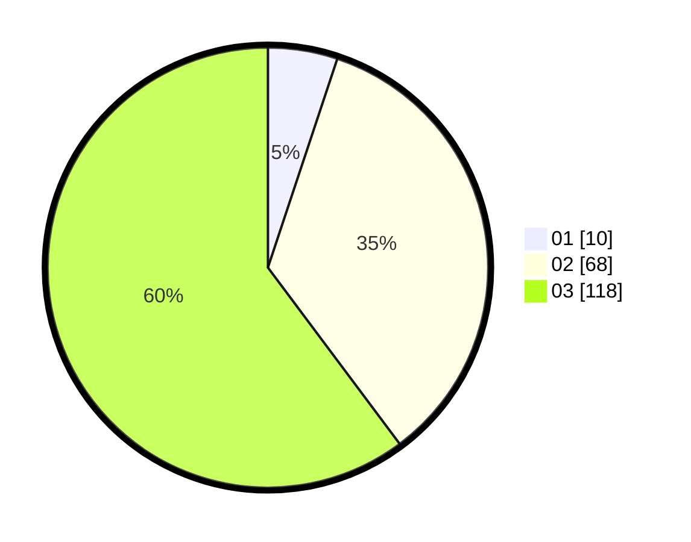

# Hasil

Hasil perolehan suara paslon dapat dilihat pada file paslon-01.txt, paslon-02.txt, dan paslon-03.txt.

Jika tidak ada, artinya data tersebut belum ada pada SIREKAP.

## Perolehan Suara

 * Paslon 01: **10**.
 * Paslon 02: **68**.
 * Paslon 03: **118**.

## Foto C Plano

https://sirekap-obj-formc.kpu.go.id/9ed5/pemilu/ppwp/31/73/08/10/04/3173081004149-20240214-204621--049cc03e-941b-481f-bdc7-9f06919ed1d7.jpg

https://sirekap-obj-formc.kpu.go.id/9ed5/pemilu/ppwp/31/73/08/10/04/3173081004149-20240214-141145--0eb1a520-e99d-4838-8df6-dc45bb0d13e1.jpg

https://sirekap-obj-formc.kpu.go.id/9ed5/pemilu/ppwp/31/73/08/10/04/3173081004149-20240214-141344--6de4142e-ada5-4a15-9d65-54fa19977eee.jpg
