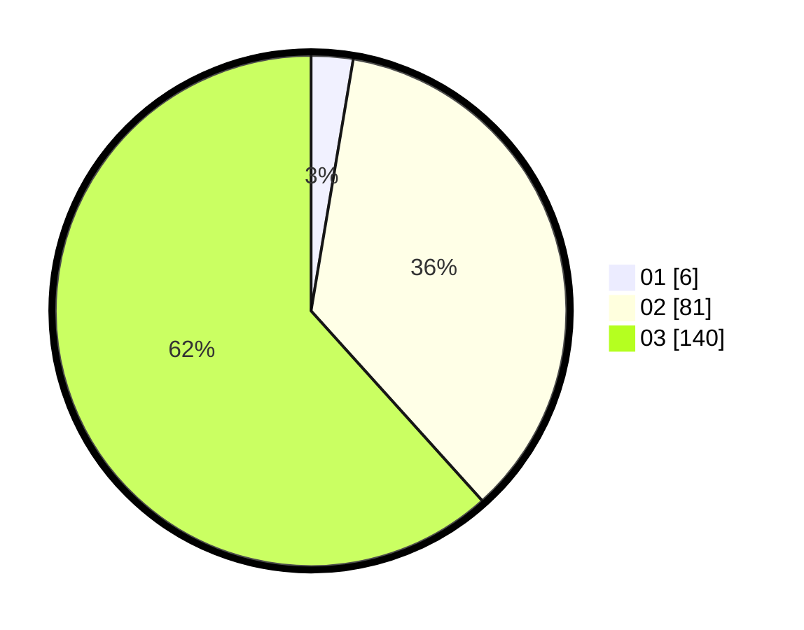

# Hasil

Hasil perolehan suara paslon dapat dilihat pada file paslon-01.txt, paslon-02.txt, dan paslon-03.txt.

Jika tidak ada, artinya data tersebut belum ada pada SIREKAP.

## Perolehan Suara

 * Paslon 01: **6**.
 * Paslon 02: **81**.
 * Paslon 03: **140**.

## Foto C Plano

https://sirekap-obj-formc.kpu.go.id/9523/pemilu/ppwp/31/73/08/10/04/3173081004152-20240214-212600--278c824a-dc6e-404d-8bb0-3344c123efc9.jpg

https://sirekap-obj-formc.kpu.go.id/9523/pemilu/ppwp/31/73/08/10/04/3173081004152-20240214-193308--0056ce45-574d-4b44-807b-ea5d57b39cc6.jpg

https://sirekap-obj-formc.kpu.go.id/9523/pemilu/ppwp/31/73/08/10/04/3173081004152-20240214-224325--330153cc-8c63-42e4-bd9e-b894ca7f834b.jpg

## DATA PEMILIH TETAP

Jumlah pemilih dalam DPT: **273**.
 * L: **123**.
 * P: **150**.

## DATA PENGGUNA HAK PILIH

Jumlah pengguna hak pilih dalam DPT: **202**.
 * L: **98**.
 * P: **104**.

Jumlah pengguna hak pilih dalam DPTb: **16**.
 * L: **5**.
 * P: **11**.

Jumlah pengguna hak pilih dalam DPK: **10**.
 * L: **4**.
 * P: **6**.

Jumlah pengguna hak pilih: **228**.
 * L: **107**.
 * P: **121**.

## JUMLAH SUARA SAH DAN TIDAK SAH

JUMLAH SELURUH SUARA SAH: **227**.

JUMLAH SUARA TIDAK SAH: **1**.

JUMLAH SELURUH SUARA SAH DAN SUARA TIDAK SAH: **228**.
