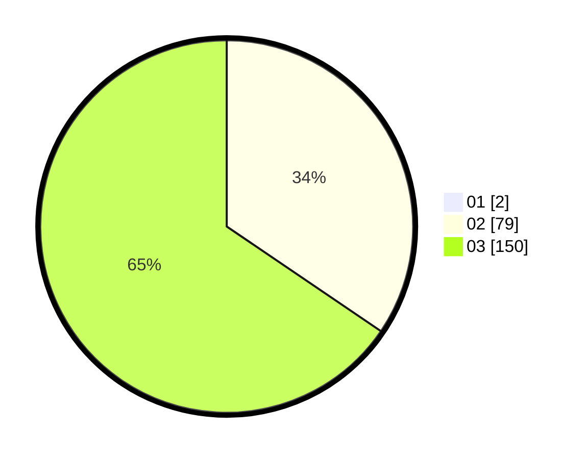

# Hasil

Hasil perolehan suara paslon dapat dilihat pada file paslon-01.txt, paslon-02.txt, dan paslon-03.txt.

Jika tidak ada, artinya data tersebut belum ada pada SIREKAP.

## Perolehan Suara

 * Paslon 01: **2**.
 * Paslon 02: **79**.
 * Paslon 03: **150**.

## Foto C Plano

https://sirekap-obj-formc.kpu.go.id/acd7/pemilu/ppwp/31/73/08/10/04/3173081004154-20240214-223501--0fef7bd2-d946-433f-869d-46340e1dae3c.jpg

https://sirekap-obj-formc.kpu.go.id/acd7/pemilu/ppwp/31/73/08/10/04/3173081004154-20240214-223524--75b1f0f5-699f-4e08-8cd5-8003b6bf1653.jpg

https://sirekap-obj-formc.kpu.go.id/acd7/pemilu/ppwp/31/73/08/10/04/3173081004154-20240214-223532--da383566-7a52-42b3-976c-bdda3755bedd.jpg
