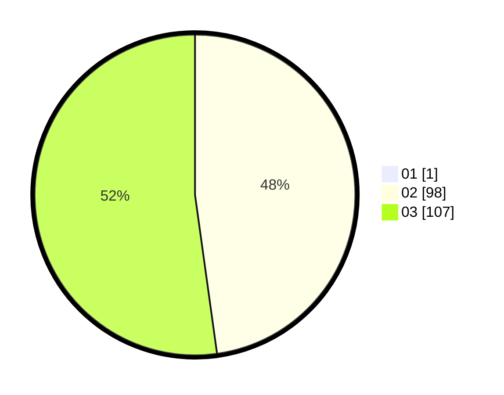

# Hasil

Hasil perolehan suara paslon dapat dilihat pada file paslon-01.txt, paslon-02.txt, dan paslon-03.txt.

Jika tidak ada, artinya data tersebut belum ada pada SIREKAP.

## Perolehan Suara

 * Paslon 01: **1**.
 * Paslon 02: **98**.
 * Paslon 03: **107**.

## Foto C Plano

https://sirekap-obj-formc.kpu.go.id/66a2/pemilu/ppwp/31/73/08/10/04/3173081004155-20240214-155437--eb28ac22-dbdc-4ce3-8e1e-945e5a1c6f8d.jpg

https://sirekap-obj-formc.kpu.go.id/66a2/pemilu/ppwp/31/73/08/10/04/3173081004155-20240214-155151--e45cdc21-71fd-47d4-b4ac-88d6dcd2f1c0.jpg

https://sirekap-obj-formc.kpu.go.id/66a2/pemilu/ppwp/31/73/08/10/04/3173081004155-20240214-155256--e5f54ad7-5e80-4241-9c74-76eb7be41dad.jpg

## DATA PEMILIH TETAP

Jumlah pemilih dalam DPT: **276**.
 * L: **132**.
 * P: **144**.

## DATA PENGGUNA HAK PILIH

Jumlah pengguna hak pilih dalam DPT: **193**.
 * L: **91**.
 * P: **102**.

Jumlah pengguna hak pilih dalam DPTb: **13**.
 * L: **5**.
 * P: **8**.

Jumlah pengguna hak pilih dalam DPK: **3**.
 * L: **3**.
 * P: **0**.

Jumlah pengguna hak pilih: **209**.
 * L: **99**.
 * P: **110**.

## JUMLAH SUARA SAH DAN TIDAK SAH

JUMLAH SELURUH SUARA SAH: **206**.

JUMLAH SUARA TIDAK SAH: **3**.

JUMLAH SELURUH SUARA SAH DAN SUARA TIDAK SAH: **209**.
