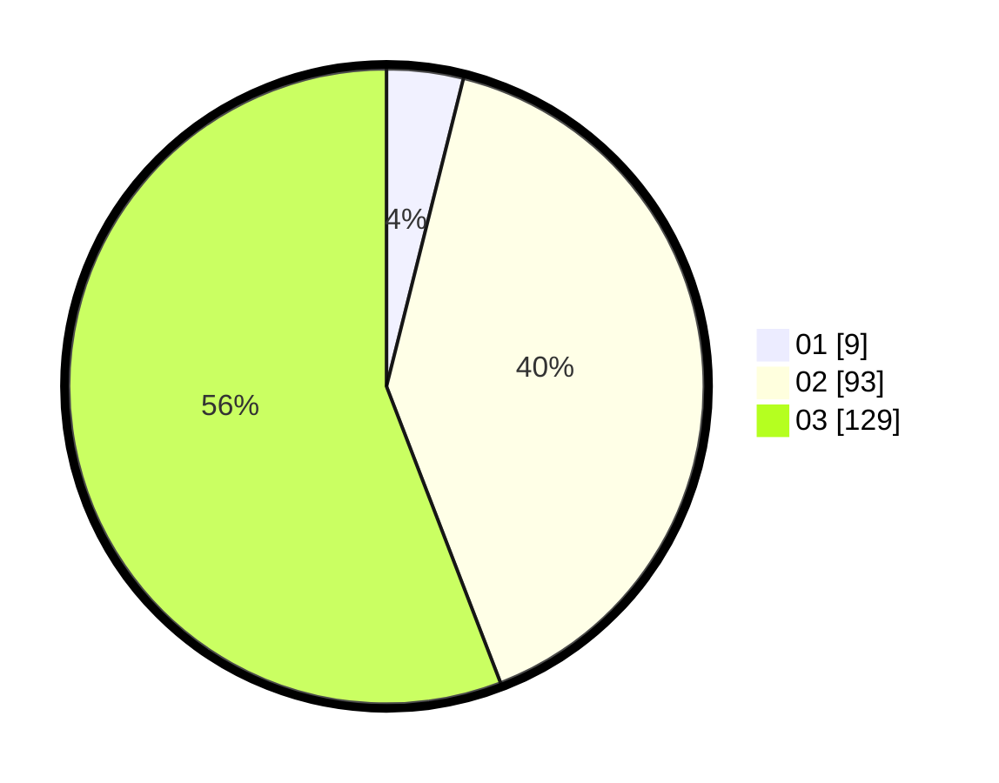

# Hasil

Hasil perolehan suara paslon dapat dilihat pada file paslon-01.txt, paslon-02.txt, dan paslon-03.txt.

Jika tidak ada, artinya data tersebut belum ada pada SIREKAP.

## Perolehan Suara

 * Paslon 01: **9**.
 * Paslon 02: **93**.
 * Paslon 03: **129**.

## Foto C Plano

https://sirekap-obj-formc.kpu.go.id/ab5e/pemilu/ppwp/31/73/08/10/04/3173081004157-20240217-180054--4e71a3b7-c605-4a9b-aa80-0c0feecb6a0b.jpg

https://sirekap-obj-formc.kpu.go.id/ab5e/pemilu/ppwp/31/73/08/10/04/3173081004157-20240217-180352--25be9233-8417-469a-8839-1a824c61eaf6.jpg

https://sirekap-obj-formc.kpu.go.id/ab5e/pemilu/ppwp/31/73/08/10/04/3173081004157-20240217-180707--126897f5-a3b6-41b5-87fe-6eb395ee5be5.jpg

## DATA PEMILIH TETAP

Jumlah pemilih dalam DPT: **296**.
 * L: **145**.
 * P: **151**.

## DATA PENGGUNA HAK PILIH

Jumlah pengguna hak pilih dalam DPT: **223**.
 * L: **111**.
 * P: **112**.

Jumlah pengguna hak pilih dalam DPTb: **11**.
 * L: **3**.
 * P: **8**.

Jumlah pengguna hak pilih dalam DPK: **2**.
 * L: **1**.
 * P: **1**.

Jumlah pengguna hak pilih: **236**.
 * L: **115**.
 * P: **121**.

## JUMLAH SUARA SAH DAN TIDAK SAH

JUMLAH SELURUH SUARA SAH: **231**.

JUMLAH SUARA TIDAK SAH: **5**.

JUMLAH SELURUH SUARA SAH DAN SUARA TIDAK SAH: **236**.
