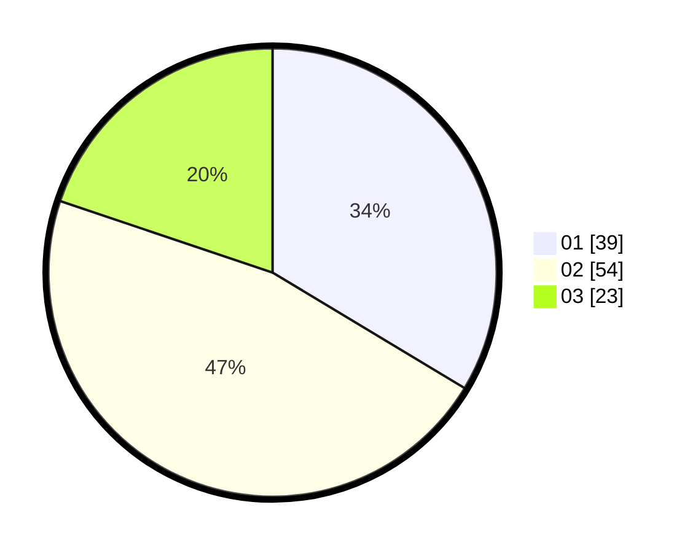

# Hasil

Hasil perolehan suara paslon dapat dilihat pada file paslon-01.txt, paslon-02.txt, dan paslon-03.txt.

Jika tidak ada, artinya data tersebut belum ada pada SIREKAP.

## Perolehan Suara

 * Paslon 01: **39**.
 * Paslon 02: **54**.
 * Paslon 03: **23**.

## Foto C Plano

https://sirekap-obj-formc.kpu.go.id/ed3b/pemilu/ppwp/31/73/08/10/04/3173081004158-20240214-235629--d8ed138f-d340-43cf-bc2b-a0d678290f46.jpg

https://sirekap-obj-formc.kpu.go.id/ed3b/pemilu/ppwp/31/73/08/10/04/3173081004158-20240214-235741--6dff2a33-e6c1-4e14-9e6a-9abd23e520b4.jpg

https://sirekap-obj-formc.kpu.go.id/ed3b/pemilu/ppwp/31/73/08/10/04/3173081004158-20240214-235949--c077e25d-3739-4ff4-a24b-b45e6fcc23b2.jpg
