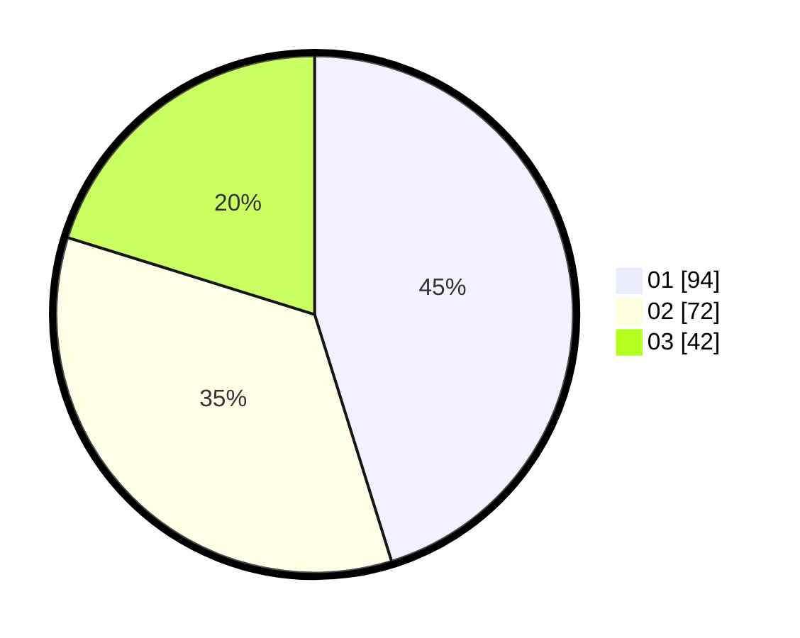

# Hasil

Hasil perolehan suara paslon dapat dilihat pada file paslon-01.txt, paslon-02.txt, dan paslon-03.txt.

Jika tidak ada, artinya data tersebut belum ada pada SIREKAP.

## Perolehan Suara

 * Paslon 01: **94**.
 * Paslon 02: **72**.
 * Paslon 03: **42**.

## Foto C Plano

https://sirekap-obj-formc.kpu.go.id/b8f5/pemilu/ppwp/31/73/08/10/05/3173081005009-20240215-000850--46719438-0773-4e51-b3a1-f2d3cf782a28.jpg

https://sirekap-obj-formc.kpu.go.id/b8f5/pemilu/ppwp/31/73/08/10/05/3173081005009-20240215-001101--cef0ad2b-b581-4e4c-b995-fbe73b684326.jpg

https://sirekap-obj-formc.kpu.go.id/b8f5/pemilu/ppwp/31/73/08/10/05/3173081005009-20240215-001316--a7eb6fe0-9dce-40fa-b366-07ea92bc7e58.jpg

## DATA PEMILIH TETAP

Jumlah pemilih dalam DPT: **283**.
 * L: **141**.
 * P: **142**.

## DATA PENGGUNA HAK PILIH

Jumlah pengguna hak pilih dalam DPT: **206**.
 * L: **97**.
 * P: **109**.

Jumlah pengguna hak pilih dalam DPTb: **2**.
 * L: **0**.
 * P: **2**.

Jumlah pengguna hak pilih dalam DPK: **0**.
 * L: **0**.
 * P: **0**.

Jumlah pengguna hak pilih: **208**.
 * L: **97**.
 * P: **111**.

## JUMLAH SUARA SAH DAN TIDAK SAH

JUMLAH SELURUH SUARA SAH: **208**.

JUMLAH SUARA TIDAK SAH: **0**.

JUMLAH SELURUH SUARA SAH DAN SUARA TIDAK SAH: **208**.
