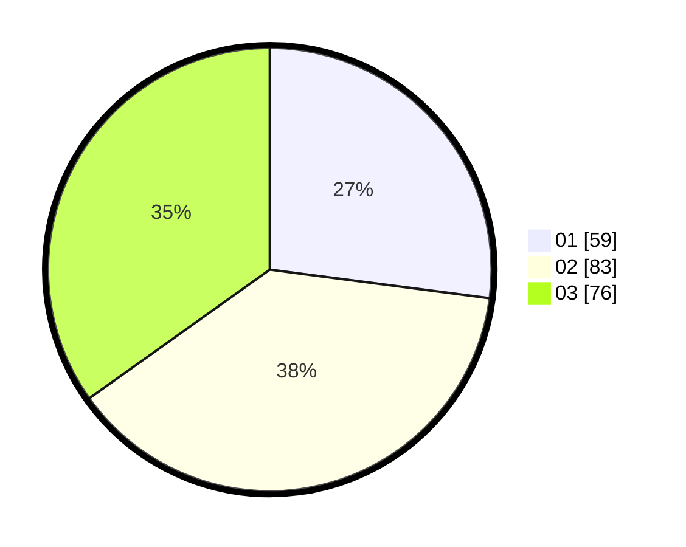

# Hasil

Hasil perolehan suara paslon dapat dilihat pada file paslon-01.txt, paslon-02.txt, dan paslon-03.txt.

Jika tidak ada, artinya data tersebut belum ada pada SIREKAP.

## Perolehan Suara

 * Paslon 01: **59**.
 * Paslon 02: **83**.
 * Paslon 03: **76**.

## Foto C Plano

https://sirekap-obj-formc.kpu.go.id/eb5d/pemilu/ppwp/31/73/08/10/05/3173081005012-20240214-213528--3634f447-4f73-4aad-b4d4-952323cb4244.jpg

https://sirekap-obj-formc.kpu.go.id/eb5d/pemilu/ppwp/31/73/08/10/05/3173081005012-20240214-213635--d08dcccb-b856-4d9c-bf9a-268285433430.jpg

https://sirekap-obj-formc.kpu.go.id/eb5d/pemilu/ppwp/31/73/08/10/05/3173081005012-20240214-213709--583e2e39-5796-4a37-8f41-80e3755c8a18.jpg
