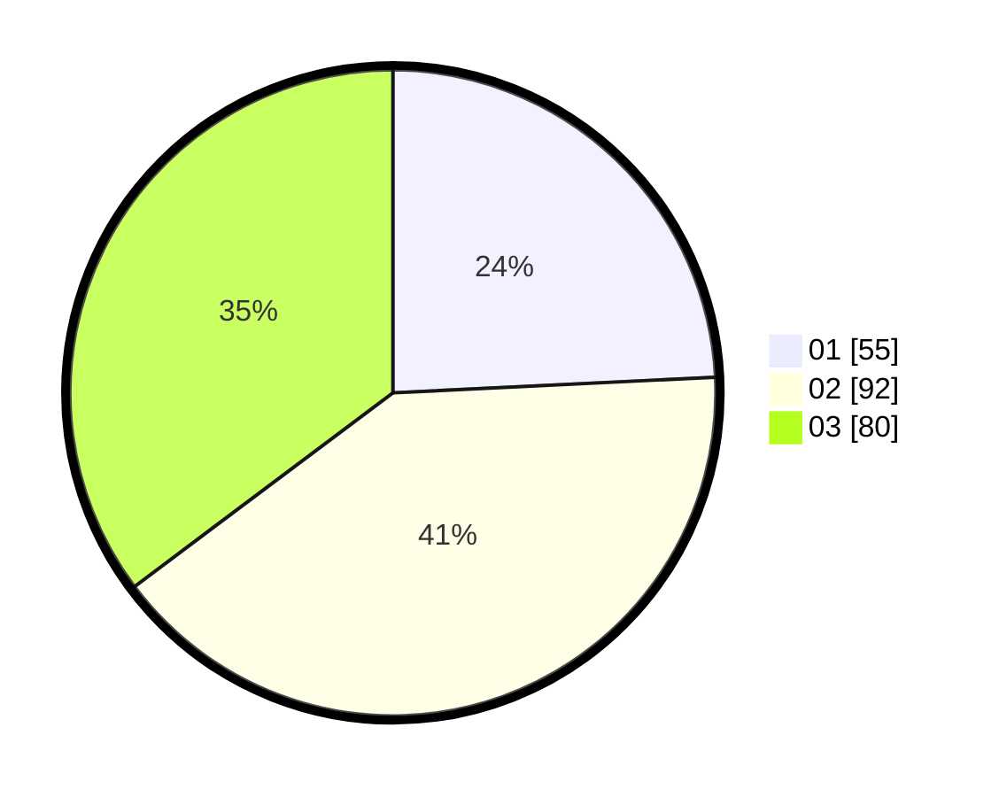

# Hasil

Hasil perolehan suara paslon dapat dilihat pada file paslon-01.txt, paslon-02.txt, dan paslon-03.txt.

Jika tidak ada, artinya data tersebut belum ada pada SIREKAP.

## Perolehan Suara

 * Paslon 01: **55**.
 * Paslon 02: **92**.
 * Paslon 03: **80**.

## Foto C Plano

https://sirekap-obj-formc.kpu.go.id/2e99/pemilu/ppwp/31/73/08/10/05/3173081005013-20240214-230236--df9b4c61-f23d-4554-8c80-61a241abb63a.jpg

https://sirekap-obj-formc.kpu.go.id/2e99/pemilu/ppwp/31/73/08/10/05/3173081005013-20240214-211301--e351df3b-9700-4534-b37c-465e3f546d37.jpg

https://sirekap-obj-formc.kpu.go.id/2e99/pemilu/ppwp/31/73/08/10/05/3173081005013-20240214-213319--0abc4baa-a5ce-497a-bc24-2e993af354ce.jpg
