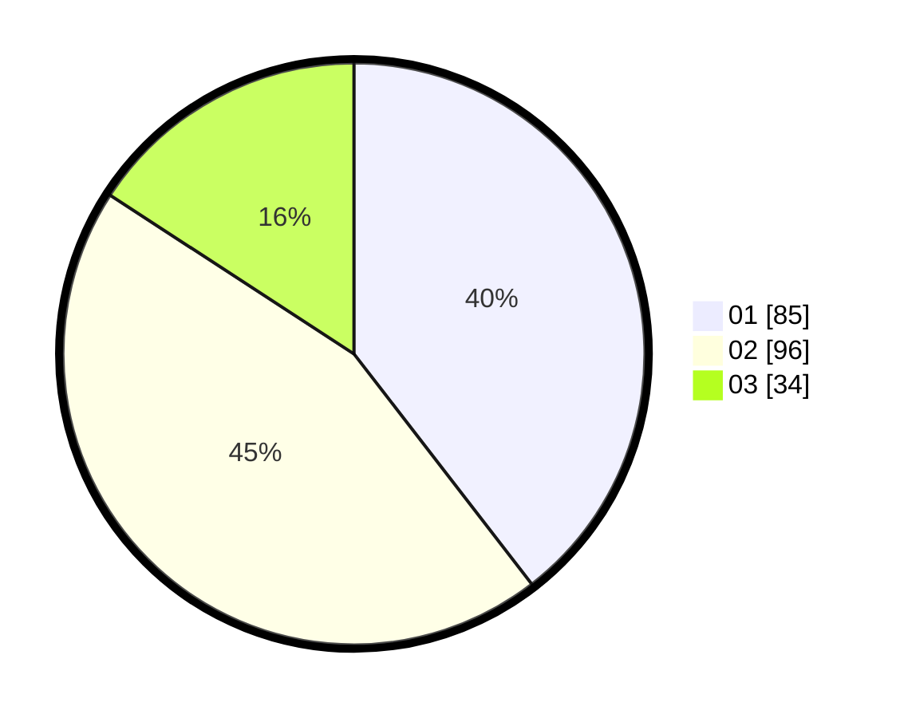

# Hasil

Hasil perolehan suara paslon dapat dilihat pada file paslon-01.txt, paslon-02.txt, dan paslon-03.txt.

Jika tidak ada, artinya data tersebut belum ada pada SIREKAP.

## Perolehan Suara

 * Paslon 01: **85**.
 * Paslon 02: **96**.
 * Paslon 03: **34**.

## Foto C Plano

https://sirekap-obj-formc.kpu.go.id/c93f/pemilu/ppwp/31/73/08/10/05/3173081005014-20240214-160132--d2f1991a-83e6-4b12-8a82-af2ed244f83c.jpg

https://sirekap-obj-formc.kpu.go.id/c93f/pemilu/ppwp/31/73/08/10/05/3173081005014-20240214-155511--5f6c7b29-5134-42cf-a727-39aa6fb33874.jpg

https://sirekap-obj-formc.kpu.go.id/c93f/pemilu/ppwp/31/73/08/10/05/3173081005014-20240214-185230--c6784396-a28d-4a46-9b59-edc386835759.jpg

## DATA PEMILIH TETAP

Jumlah pemilih dalam DPT: **279**.
 * L: **146**.
 * P: **133**.

## DATA PENGGUNA HAK PILIH

Jumlah pengguna hak pilih dalam DPT: **207**.
 * L: **108**.
 * P: **99**.

Jumlah pengguna hak pilih dalam DPTb: **10**.
 * L: **1**.
 * P: **9**.

Jumlah pengguna hak pilih dalam DPK: **3**.
 * L: **0**.
 * P: **3**.

Jumlah pengguna hak pilih: **220**.
 * L: **109**.
 * P: **111**.

## JUMLAH SUARA SAH DAN TIDAK SAH

JUMLAH SELURUH SUARA SAH: **215**.

JUMLAH SUARA TIDAK SAH: **5**.

JUMLAH SELURUH SUARA SAH DAN SUARA TIDAK SAH: **220**.
