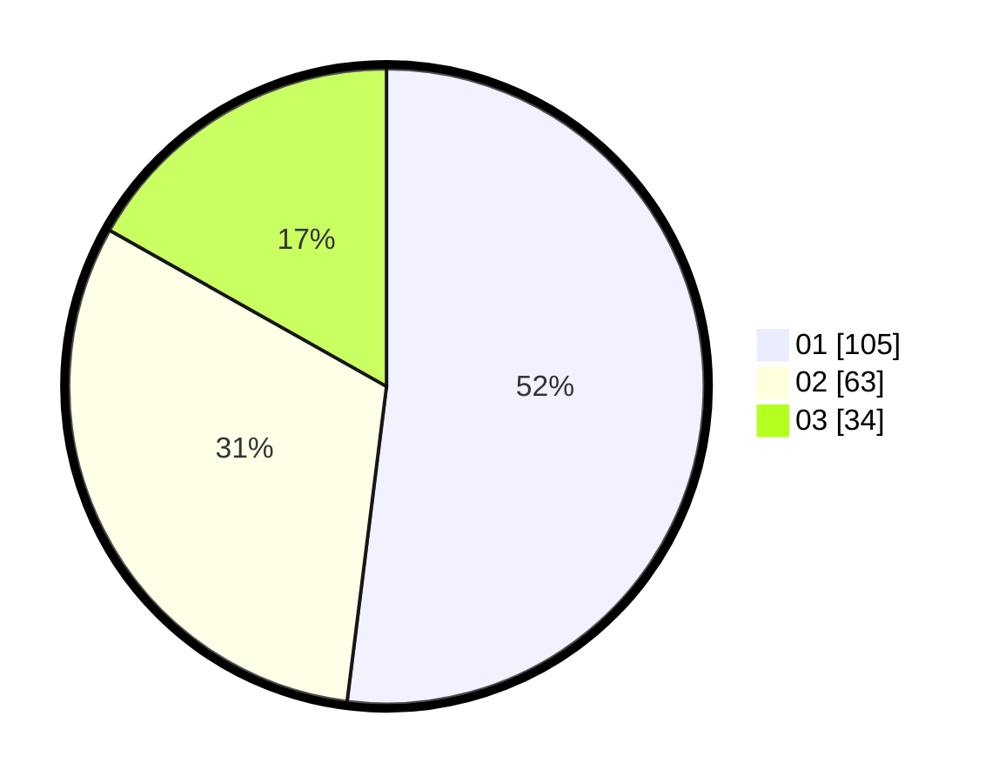

# Hasil

Hasil perolehan suara paslon dapat dilihat pada file paslon-01.txt, paslon-02.txt, dan paslon-03.txt.

Jika tidak ada, artinya data tersebut belum ada pada SIREKAP.

## Perolehan Suara

 * Paslon 01: **105**.
 * Paslon 02: **63**.
 * Paslon 03: **34**.

## Foto C Plano

https://sirekap-obj-formc.kpu.go.id/3124/pemilu/ppwp/31/73/08/10/05/3173081005016-20240214-160114--8ba175e0-47b2-48d8-afcf-1194bb021e47.jpg

https://sirekap-obj-formc.kpu.go.id/3124/pemilu/ppwp/31/73/08/10/05/3173081005016-20240214-160056--7601cb2a-ca8a-4e49-9629-da1fe8d41c3e.jpg

https://sirekap-obj-formc.kpu.go.id/3124/pemilu/ppwp/31/73/08/10/05/3173081005016-20240214-160135--5e837719-ca4b-43d0-a986-7fe68f8a4534.jpg

## DATA PEMILIH TETAP

Jumlah pemilih dalam DPT: **274**.
 * L: **736**.
 * P: **138**.

## DATA PENGGUNA HAK PILIH

Jumlah pengguna hak pilih dalam DPT: **200**.
 * L: **707**.
 * P: **99**.

Jumlah pengguna hak pilih dalam DPTb: **3**.
 * L: **7**.
 * P: **2**.

Jumlah pengguna hak pilih dalam DPK: **3**.
 * L: **2**.
 * P: **7**.

Jumlah pengguna hak pilih: **206**.
 * L: **704**.
 * P: **502**.

## JUMLAH SUARA SAH DAN TIDAK SAH

JUMLAH SELURUH SUARA SAH: **202**.

JUMLAH SUARA TIDAK SAH: **4**.

JUMLAH SELURUH SUARA SAH DAN SUARA TIDAK SAH: **206**.
