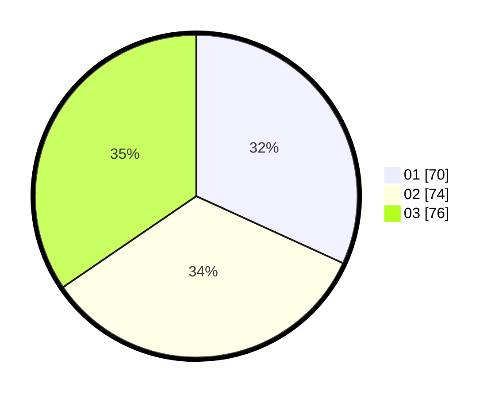

# Hasil

Hasil perolehan suara paslon dapat dilihat pada file paslon-01.txt, paslon-02.txt, dan paslon-03.txt.

Jika tidak ada, artinya data tersebut belum ada pada SIREKAP.

## Perolehan Suara

 * Paslon 01: **70**.
 * Paslon 02: **74**.
 * Paslon 03: **76**.

## Foto C Plano

https://sirekap-obj-formc.kpu.go.id/7972/pemilu/ppwp/31/73/08/10/05/3173081005017-20240215-231642--1917f1e8-0d29-41a7-886d-b4f16705c31e.jpg

https://sirekap-obj-formc.kpu.go.id/7972/pemilu/ppwp/31/73/08/10/05/3173081005017-20240214-231822--91a9e2b4-16ea-499f-9780-fd1bf536b67d.jpg

https://sirekap-obj-formc.kpu.go.id/7972/pemilu/ppwp/31/73/08/10/05/3173081005017-20240214-232024--27d4f80c-a315-44bc-9bb9-4a15d5b2e5d7.jpg
