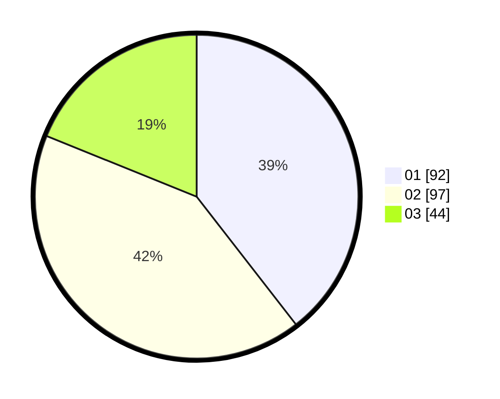

# Hasil

Hasil perolehan suara paslon dapat dilihat pada file paslon-01.txt, paslon-02.txt, dan paslon-03.txt.

Jika tidak ada, artinya data tersebut belum ada pada SIREKAP.

## Perolehan Suara

 * Paslon 01: **92**.
 * Paslon 02: **97**.
 * Paslon 03: **44**.

## Foto C Plano

https://sirekap-obj-formc.kpu.go.id/4072/pemilu/ppwp/31/73/08/10/05/3173081005018-20240217-000548--c784ad99-db1c-42ca-ac68-76981087195a.jpg

https://sirekap-obj-formc.kpu.go.id/4072/pemilu/ppwp/31/73/08/10/05/3173081005018-20240217-000549--f22dcb0c-9d22-4c85-96d4-4b46a813cc97.jpg

https://sirekap-obj-formc.kpu.go.id/4072/pemilu/ppwp/31/73/08/10/05/3173081005018-20240217-000548--068ae0cb-ee97-4601-b929-99ccec04768a.jpg

## DATA PEMILIH TETAP

Jumlah pemilih dalam DPT: **280**.
 * L: **145**.
 * P: **135**.

## DATA PENGGUNA HAK PILIH

Jumlah pengguna hak pilih dalam DPT: **233**.
 * L: **121**.
 * P: **112**.

Jumlah pengguna hak pilih dalam DPTb: **1**.
 * L: **0**.
 * P: **1**.

Jumlah pengguna hak pilih dalam DPK: **4**.
 * L: **2**.
 * P: **2**.

Jumlah pengguna hak pilih: **238**.
 * L: **123**.
 * P: **115**.

## JUMLAH SUARA SAH DAN TIDAK SAH

JUMLAH SELURUH SUARA SAH: **233**.

JUMLAH SUARA TIDAK SAH: **5**.

JUMLAH SELURUH SUARA SAH DAN SUARA TIDAK SAH: **238**.
