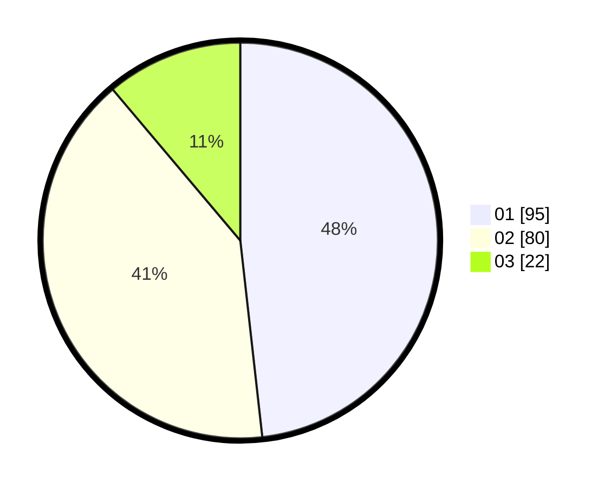

# Hasil

Hasil perolehan suara paslon dapat dilihat pada file paslon-01.txt, paslon-02.txt, dan paslon-03.txt.

Jika tidak ada, artinya data tersebut belum ada pada SIREKAP.

## Perolehan Suara

 * Paslon 01: **95**.
 * Paslon 02: **80**.
 * Paslon 03: **22**.

## Foto C Plano

https://sirekap-obj-formc.kpu.go.id/1f6c/pemilu/ppwp/31/73/08/10/05/3173081005026-20240214-155601--28658fdb-7654-496f-88d7-8b6426ad6298.jpg

https://sirekap-obj-formc.kpu.go.id/1f6c/pemilu/ppwp/31/73/08/10/05/3173081005026-20240214-155649--fda91894-e71f-4ab5-9a85-176889352f35.jpg

https://sirekap-obj-formc.kpu.go.id/1f6c/pemilu/ppwp/31/73/08/10/05/3173081005026-20240214-155734--d39acb78-546f-4f88-b104-392d7979870f.jpg

## DATA PEMILIH TETAP

Jumlah pemilih dalam DPT: **234**.
 * L: **114**.
 * P: **120**.

## DATA PENGGUNA HAK PILIH

Jumlah pengguna hak pilih dalam DPT: **198**.
 * L: **91**.
 * P: **107**.

Jumlah pengguna hak pilih dalam DPTb: **1**.
 * L: **0**.
 * P: **1**.

Jumlah pengguna hak pilih dalam DPK: **1**.
 * L: **0**.
 * P: **1**.

Jumlah pengguna hak pilih: **200**.
 * L: **91**.
 * P: **109**.

## JUMLAH SUARA SAH DAN TIDAK SAH

JUMLAH SELURUH SUARA SAH: **197**.

JUMLAH SUARA TIDAK SAH: **3**.

JUMLAH SELURUH SUARA SAH DAN SUARA TIDAK SAH: **200**.
