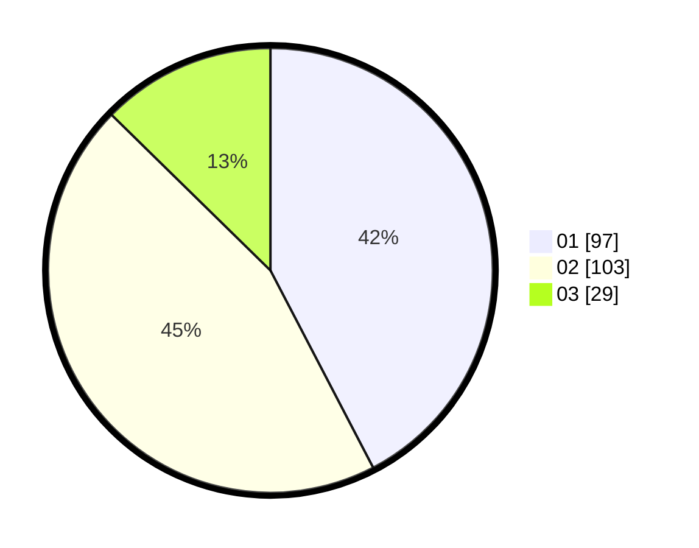

# Hasil

Hasil perolehan suara paslon dapat dilihat pada file paslon-01.txt, paslon-02.txt, dan paslon-03.txt.

Jika tidak ada, artinya data tersebut belum ada pada SIREKAP.

## Perolehan Suara

 * Paslon 01: **97**.
 * Paslon 02: **103**.
 * Paslon 03: **29**.

## Foto C Plano

https://sirekap-obj-formc.kpu.go.id/526b/pemilu/ppwp/31/73/08/10/05/3173081005028-20240214-155439--dc60812e-6f6c-4b07-bda4-ff7336ffb79d.jpg

https://sirekap-obj-formc.kpu.go.id/526b/pemilu/ppwp/31/73/08/10/05/3173081005028-20240214-155527--3c2cf634-73d8-4220-a596-e578b3611e0b.jpg

https://sirekap-obj-formc.kpu.go.id/526b/pemilu/ppwp/31/73/08/10/05/3173081005028-20240214-160145--6c2b2b96-dbad-4527-bb9a-f51d761d559c.jpg
