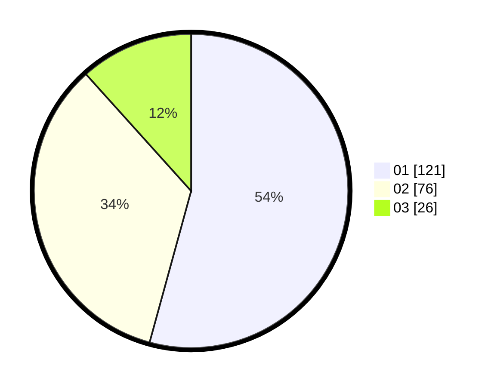

# Hasil

Hasil perolehan suara paslon dapat dilihat pada file paslon-01.txt, paslon-02.txt, dan paslon-03.txt.

Jika tidak ada, artinya data tersebut belum ada pada SIREKAP.

## Perolehan Suara

 * Paslon 01: **121**.
 * Paslon 02: **76**.
 * Paslon 03: **26**.

## Foto C Plano

https://sirekap-obj-formc.kpu.go.id/7574/pemilu/ppwp/31/73/08/10/05/3173081005030-20240214-155739--93d0634e-697b-4aad-a6f6-cefc400b4a16.jpg

https://sirekap-obj-formc.kpu.go.id/7574/pemilu/ppwp/31/73/08/10/05/3173081005030-20240214-155857--09578f6d-5ee9-4cd7-aba4-c51918d5b366.jpg

https://sirekap-obj-formc.kpu.go.id/7574/pemilu/ppwp/31/73/08/10/05/3173081005030-20240214-160104--15c64182-eb3e-4a61-b880-0a07773b2f3f.jpg

## DATA PEMILIH TETAP

Jumlah pemilih dalam DPT: **283**.
 * L: **132**.
 * P: **151**.

## DATA PENGGUNA HAK PILIH

Jumlah pengguna hak pilih dalam DPT: **225**.
 * L: **103**.
 * P: **122**.

Jumlah pengguna hak pilih dalam DPTb: **0**.
 * L: **0**.
 * P: **0**.

Jumlah pengguna hak pilih dalam DPK: **0**.
 * L: **0**.
 * P: **0**.

Jumlah pengguna hak pilih: **225**.
 * L: **103**.
 * P: **122**.

## JUMLAH SUARA SAH DAN TIDAK SAH

JUMLAH SELURUH SUARA SAH: **223**.

JUMLAH SUARA TIDAK SAH: **2**.

JUMLAH SELURUH SUARA SAH DAN SUARA TIDAK SAH: **225**.
