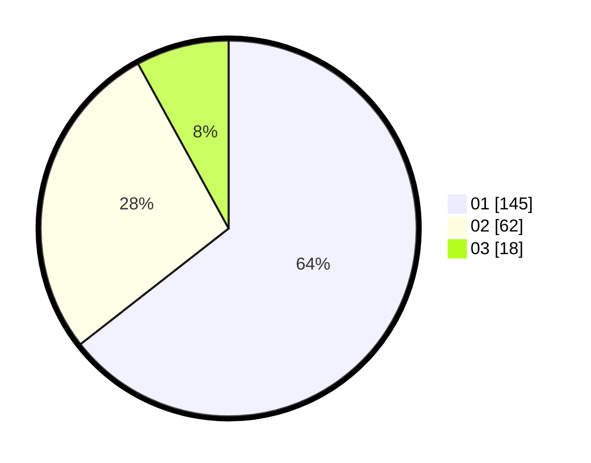

# Hasil

Hasil perolehan suara paslon dapat dilihat pada file paslon-01.txt, paslon-02.txt, dan paslon-03.txt.

Jika tidak ada, artinya data tersebut belum ada pada SIREKAP.

## Perolehan Suara

 * Paslon 01: **145**.
 * Paslon 02: **62**.
 * Paslon 03: **18**.

## Foto C Plano

https://sirekap-obj-formc.kpu.go.id/7cb3/pemilu/ppwp/31/73/08/10/05/3173081005033-20240214-192554--1f205f06-c63b-4fce-b15a-466217c97314.jpg

https://sirekap-obj-formc.kpu.go.id/7cb3/pemilu/ppwp/31/73/08/10/05/3173081005033-20240214-192646--006b8188-fc59-4a8b-91a5-9c6218e004d0.jpg

https://sirekap-obj-formc.kpu.go.id/7cb3/pemilu/ppwp/31/73/08/10/05/3173081005033-20240214-192726--e38a244e-5bbd-472b-8531-5e7adae4790e.jpg

## DATA PEMILIH TETAP

Jumlah pemilih dalam DPT: **295**.
 * L: **142**.
 * P: **153**.

## DATA PENGGUNA HAK PILIH

Jumlah pengguna hak pilih dalam DPT: **227**.
 * L: **114**.
 * P: **113**.

Jumlah pengguna hak pilih dalam DPTb: **0**.
 * L: **0**.
 * P: **0**.

Jumlah pengguna hak pilih dalam DPK: **2**.
 * L: **2**.
 * P: **0**.

Jumlah pengguna hak pilih: **229**.
 * L: **116**.
 * P: **113**.

## JUMLAH SUARA SAH DAN TIDAK SAH

JUMLAH SELURUH SUARA SAH: **225**.

JUMLAH SUARA TIDAK SAH: **4**.

JUMLAH SELURUH SUARA SAH DAN SUARA TIDAK SAH: **229**.
