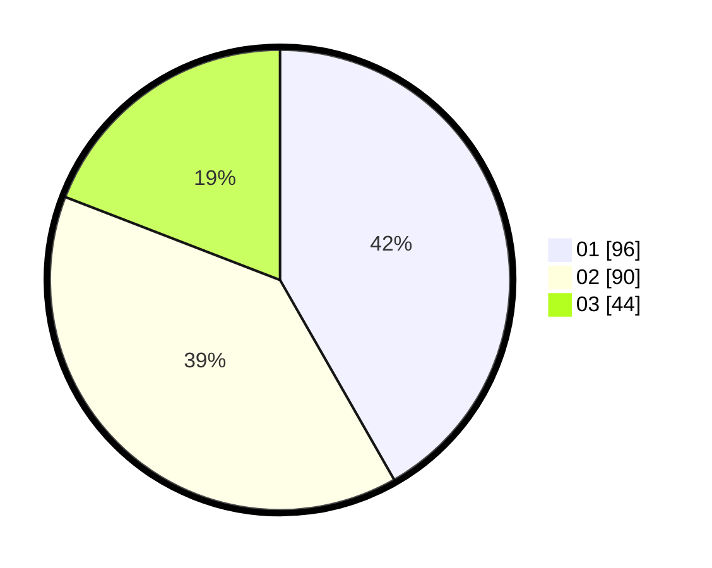

# Hasil

Hasil perolehan suara paslon dapat dilihat pada file paslon-01.txt, paslon-02.txt, dan paslon-03.txt.

Jika tidak ada, artinya data tersebut belum ada pada SIREKAP.

## Perolehan Suara

 * Paslon 01: **96**.
 * Paslon 02: **90**.
 * Paslon 03: **44**.

## Foto C Plano

https://sirekap-obj-formc.kpu.go.id/3f23/pemilu/ppwp/31/73/08/10/05/3173081005037-20240214-220329--de6ac957-d699-4f65-9279-7a55ff4c3ef7.jpg

https://sirekap-obj-formc.kpu.go.id/3f23/pemilu/ppwp/31/73/08/10/05/3173081005037-20240214-220551--64efeda2-f4a1-4474-a174-885d6d2a90c9.jpg

https://sirekap-obj-formc.kpu.go.id/3f23/pemilu/ppwp/31/73/08/10/05/3173081005037-20240214-220901--29a04927-3ffa-445c-8dac-c5f018ce163b.jpg
