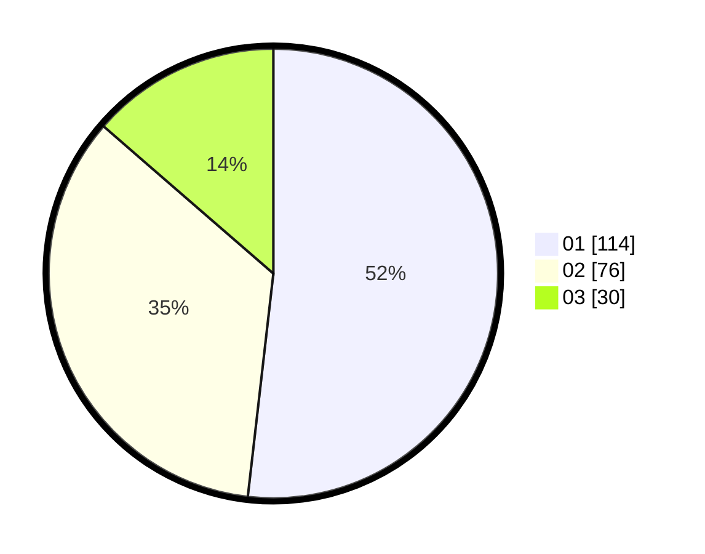

# Hasil

Hasil perolehan suara paslon dapat dilihat pada file paslon-01.txt, paslon-02.txt, dan paslon-03.txt.

Jika tidak ada, artinya data tersebut belum ada pada SIREKAP.

## Perolehan Suara

 * Paslon 01: **114**.
 * Paslon 02: **76**.
 * Paslon 03: **30**.

## Foto C Plano

https://sirekap-obj-formc.kpu.go.id/ebb6/pemilu/ppwp/31/73/08/10/05/3173081005038-20240215-223352--979a79db-94e6-4c4f-96d7-5395e73d81f0.jpg

https://sirekap-obj-formc.kpu.go.id/ebb6/pemilu/ppwp/31/73/08/10/05/3173081005038-20240215-223355--09dc5b94-9bba-4ccc-b180-5d4067b2d33f.jpg

https://sirekap-obj-formc.kpu.go.id/ebb6/pemilu/ppwp/31/73/08/10/05/3173081005038-20240215-223353--f869a42b-ae2f-40e7-8d5b-bd8422a3373e.jpg

## DATA PEMILIH TETAP

Jumlah pemilih dalam DPT: **292**.
 * L: **149**.
 * P: **143**.

## DATA PENGGUNA HAK PILIH

Jumlah pengguna hak pilih dalam DPT: **218**.
 * L: **111**.
 * P: **107**.

Jumlah pengguna hak pilih dalam DPTb: **1**.
 * L: **0**.
 * P: **1**.

Jumlah pengguna hak pilih dalam DPK: **5**.
 * L: **1**.
 * P: **4**.

Jumlah pengguna hak pilih: **224**.
 * L: **112**.
 * P: **112**.

## JUMLAH SUARA SAH DAN TIDAK SAH

JUMLAH SELURUH SUARA SAH: **220**.

JUMLAH SUARA TIDAK SAH: **4**.

JUMLAH SELURUH SUARA SAH DAN SUARA TIDAK SAH: **224**.
