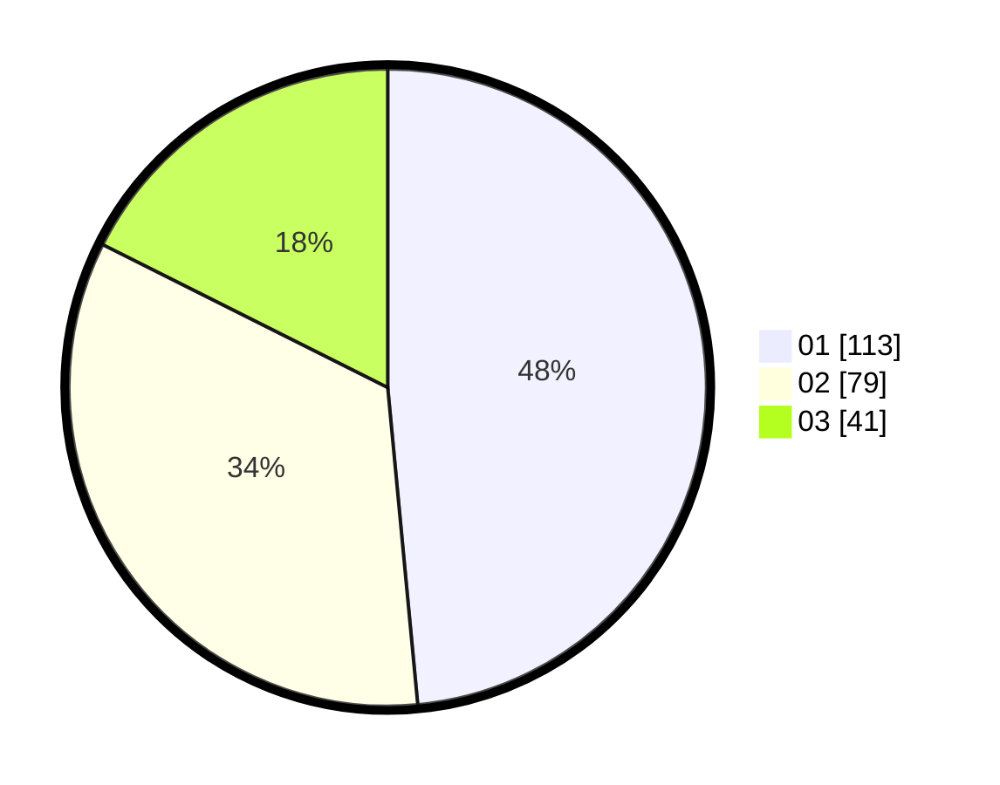

# Hasil

Hasil perolehan suara paslon dapat dilihat pada file paslon-01.txt, paslon-02.txt, dan paslon-03.txt.

Jika tidak ada, artinya data tersebut belum ada pada SIREKAP.

## Perolehan Suara

 * Paslon 01: **113**.
 * Paslon 02: **79**.
 * Paslon 03: **41**.

## Foto C Plano

https://sirekap-obj-formc.kpu.go.id/5085/pemilu/ppwp/31/73/08/10/05/3173081005042-20240214-175317--43b3e828-2b6e-4ad5-9cb8-8a66ad8f319a.jpg

https://sirekap-obj-formc.kpu.go.id/5085/pemilu/ppwp/31/73/08/10/05/3173081005042-20240214-175442--c6c73d2c-4591-4c72-9114-27d129438346.jpg
