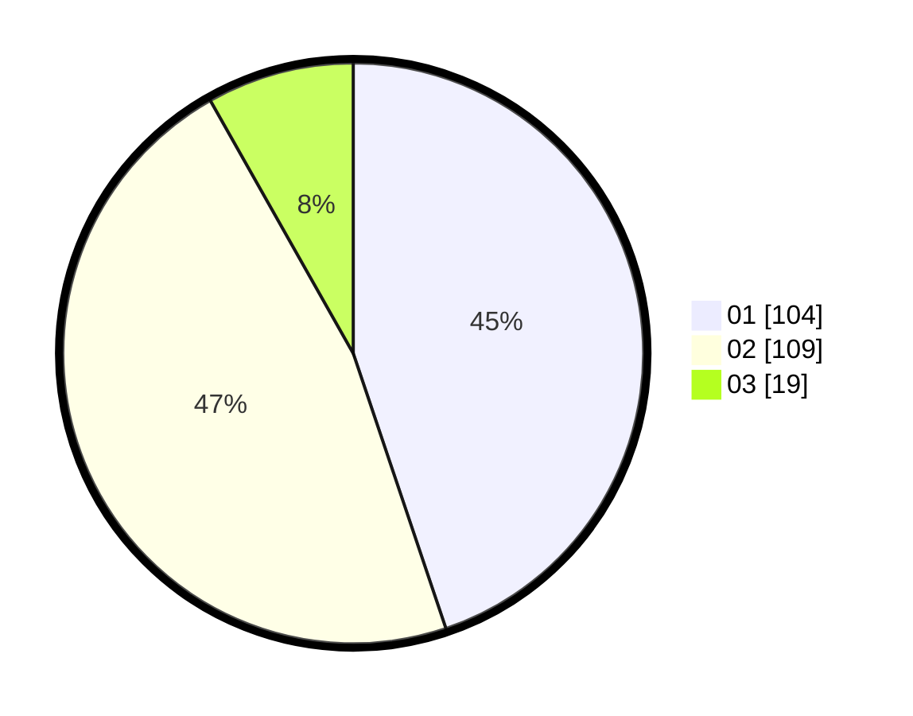

# Hasil

Hasil perolehan suara paslon dapat dilihat pada file paslon-01.txt, paslon-02.txt, dan paslon-03.txt.

Jika tidak ada, artinya data tersebut belum ada pada SIREKAP.

## Perolehan Suara

 * Paslon 01: **104**.
 * Paslon 02: **109**.
 * Paslon 03: **19**.

## Foto C Plano

https://sirekap-obj-formc.kpu.go.id/b857/pemilu/ppwp/31/73/08/10/05/3173081005044-20240214-155845--db8d561f-6e40-4633-bb11-d4c6aece2e8b.jpg

https://sirekap-obj-formc.kpu.go.id/b857/pemilu/ppwp/31/73/08/10/05/3173081005044-20240214-160108--dd54ed08-3463-4065-b8d0-228600b7214b.jpg
