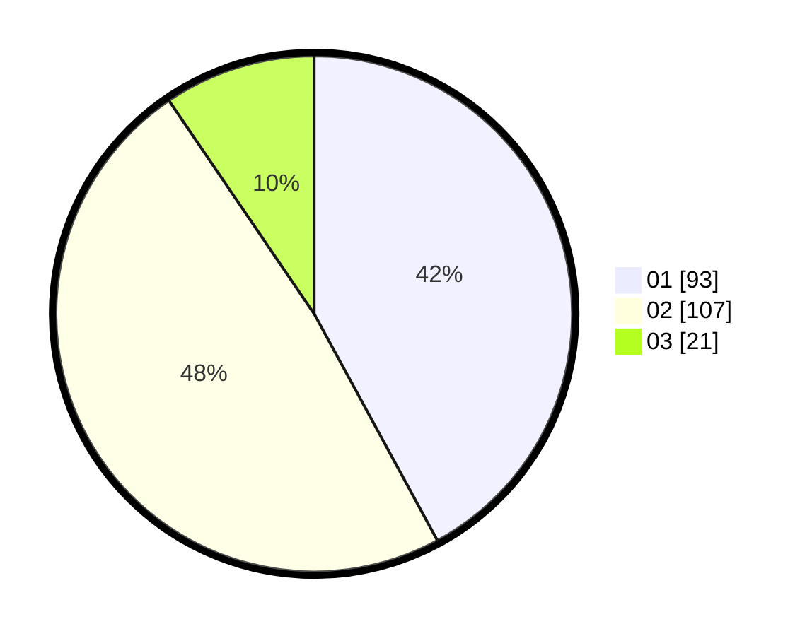

# Hasil

Hasil perolehan suara paslon dapat dilihat pada file paslon-01.txt, paslon-02.txt, dan paslon-03.txt.

Jika tidak ada, artinya data tersebut belum ada pada SIREKAP.

## Perolehan Suara

 * Paslon 01: **93**.
 * Paslon 02: **107**.
 * Paslon 03: **21**.

## Foto C Plano

https://sirekap-obj-formc.kpu.go.id/dd21/pemilu/ppwp/31/73/08/10/05/3173081005045-20240216-195703--cacca7ec-7b50-4664-862e-a6a8664fe758.jpg

https://sirekap-obj-formc.kpu.go.id/dd21/pemilu/ppwp/31/73/08/10/05/3173081005045-20240216-195705--755092f1-2c56-433f-97e1-f93dc974beab.jpg

https://sirekap-obj-formc.kpu.go.id/dd21/pemilu/ppwp/31/73/08/10/05/3173081005045-20240216-195704--f17d820f-32e2-4f0b-87bf-450a85292530.jpg

## DATA PEMILIH TETAP

Jumlah pemilih dalam DPT: **296**.
 * L: **146**.
 * P: **150**.

## DATA PENGGUNA HAK PILIH

Jumlah pengguna hak pilih dalam DPT: **222**.
 * L: **108**.
 * P: **114**.

Jumlah pengguna hak pilih dalam DPTb: **0**.
 * L: **0**.
 * P: **0**.

Jumlah pengguna hak pilih dalam DPK: **2**.
 * L: **0**.
 * P: **2**.

Jumlah pengguna hak pilih: **224**.
 * L: **108**.
 * P: **116**.

## JUMLAH SUARA SAH DAN TIDAK SAH

JUMLAH SELURUH SUARA SAH: **221**.

JUMLAH SUARA TIDAK SAH: **3**.

JUMLAH SELURUH SUARA SAH DAN SUARA TIDAK SAH: **224**.
