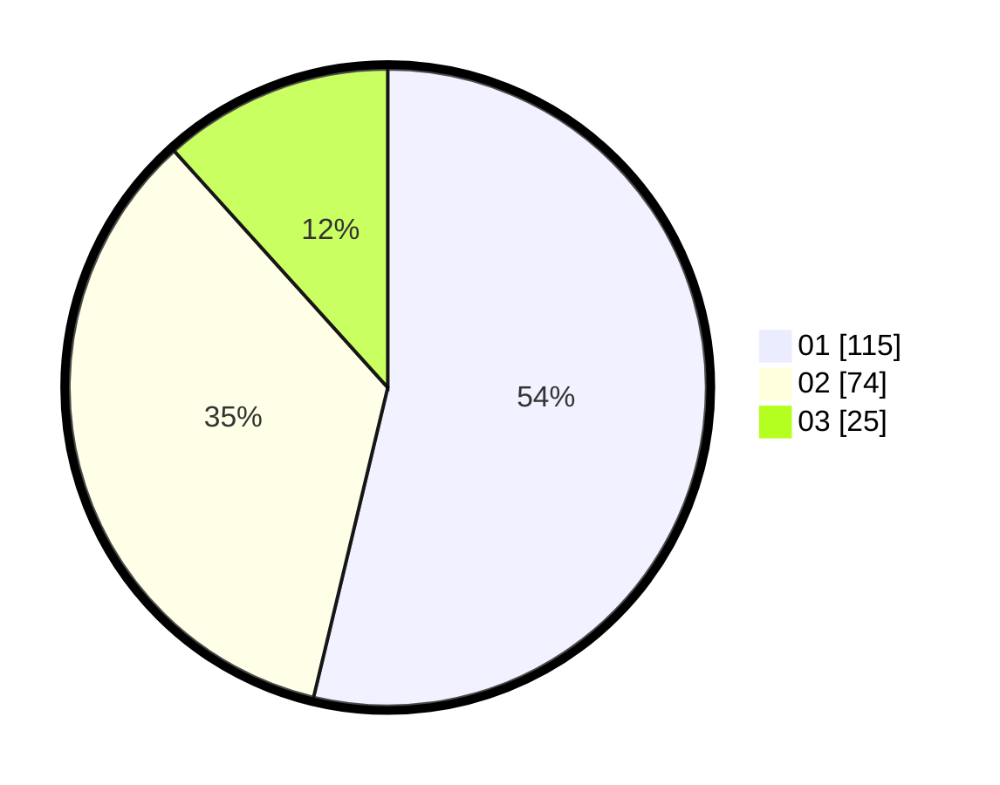

# Hasil

Hasil perolehan suara paslon dapat dilihat pada file paslon-01.txt, paslon-02.txt, dan paslon-03.txt.

Jika tidak ada, artinya data tersebut belum ada pada SIREKAP.

## Perolehan Suara

 * Paslon 01: **115**.
 * Paslon 02: **74**.
 * Paslon 03: **25**.

## Foto C Plano

https://sirekap-obj-formc.kpu.go.id/a898/pemilu/ppwp/31/73/08/10/05/3173081005050-20240215-014907--b9a454cd-20ae-4bd4-aa04-246d8fde6c49.jpg

https://sirekap-obj-formc.kpu.go.id/a898/pemilu/ppwp/31/73/08/10/05/3173081005050-20240215-012218--4696d1a6-7694-4449-9f74-ad8a50c708cc.jpg

https://sirekap-obj-formc.kpu.go.id/a898/pemilu/ppwp/31/73/08/10/05/3173081005050-20240215-012313--62469673-6a31-47df-9de1-793ba0069cde.jpg
