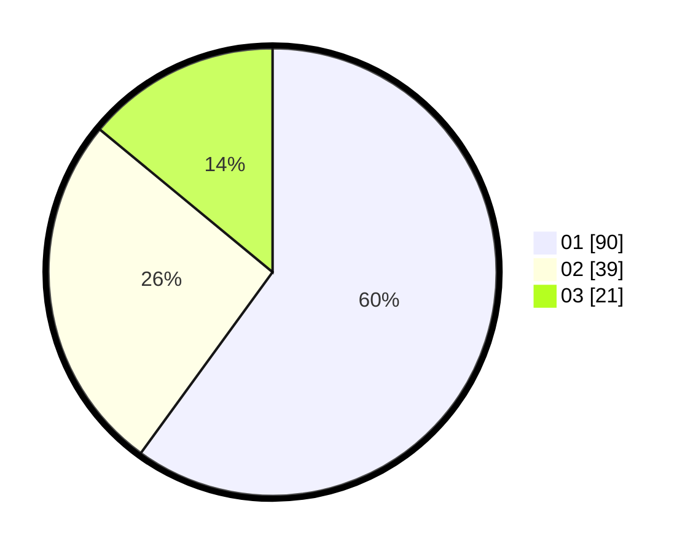

# Hasil

Hasil perolehan suara paslon dapat dilihat pada file paslon-01.txt, paslon-02.txt, dan paslon-03.txt.

Jika tidak ada, artinya data tersebut belum ada pada SIREKAP.

## Perolehan Suara

 * Paslon 01: **90**.
 * Paslon 02: **39**.
 * Paslon 03: **21**.

## Foto C Plano

https://sirekap-obj-formc.kpu.go.id/2c3f/pemilu/ppwp/31/73/08/10/05/3173081005057-20240215-161724--3568c4fc-52b7-48bd-b4a4-096e2f1ade06.jpg

https://sirekap-obj-formc.kpu.go.id/2c3f/pemilu/ppwp/31/73/08/10/05/3173081005057-20240215-161746--f34af84e-9301-4d08-a8a1-0e4a9018433b.jpg

https://sirekap-obj-formc.kpu.go.id/2c3f/pemilu/ppwp/31/73/08/10/05/3173081005057-20240215-161735--2d9e91c7-90f7-45e8-b4cf-09b370042e92.jpg

## DATA PEMILIH TETAP

Jumlah pemilih dalam DPT: **198**.
 * L: **96**.
 * P: **102**.

## DATA PENGGUNA HAK PILIH

Jumlah pengguna hak pilih dalam DPT: **145**.
 * L: **65**.
 * P: **80**.

Jumlah pengguna hak pilih dalam DPTb: **1**.
 * L: **1**.
 * P: **0**.

Jumlah pengguna hak pilih dalam DPK: **7**.
 * L: **4**.
 * P: **3**.

Jumlah pengguna hak pilih: **153**.
 * L: **70**.
 * P: **83**.

## JUMLAH SUARA SAH DAN TIDAK SAH

JUMLAH SELURUH SUARA SAH: **150**.

JUMLAH SUARA TIDAK SAH: **3**.

JUMLAH SELURUH SUARA SAH DAN SUARA TIDAK SAH: **153**.
