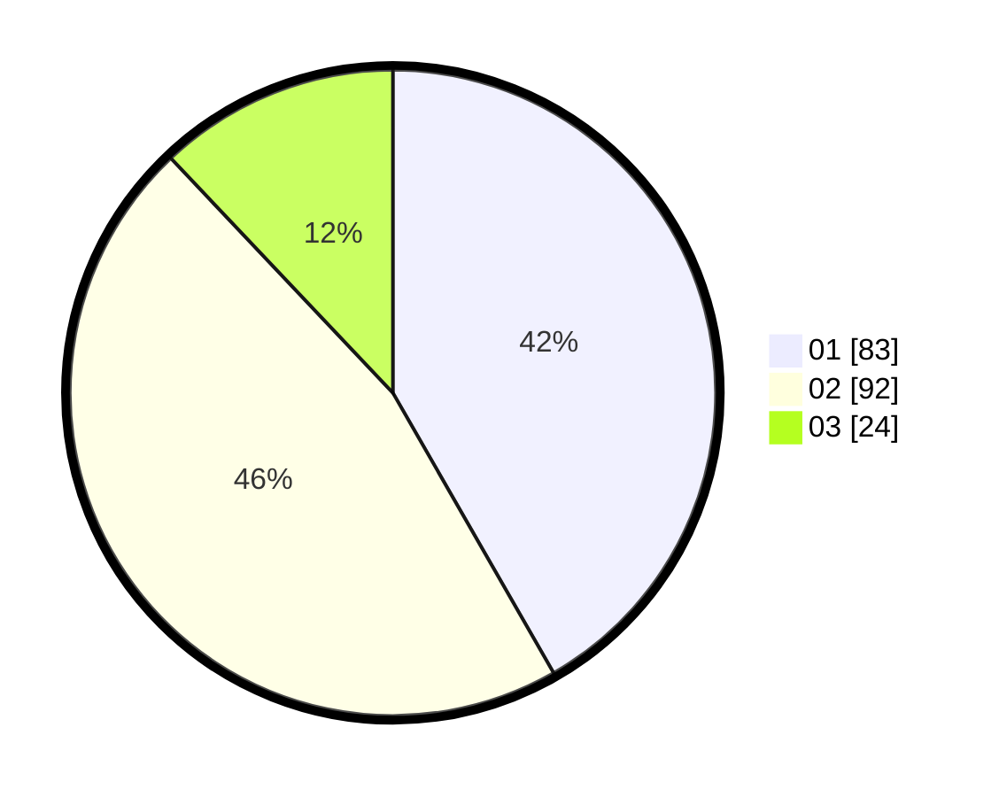

# Hasil

Hasil perolehan suara paslon dapat dilihat pada file paslon-01.txt, paslon-02.txt, dan paslon-03.txt.

Jika tidak ada, artinya data tersebut belum ada pada SIREKAP.

## Perolehan Suara

 * Paslon 01: **83**.
 * Paslon 02: **92**.
 * Paslon 03: **24**.

## Foto C Plano

https://sirekap-obj-formc.kpu.go.id/58e0/pemilu/ppwp/31/73/08/10/05/3173081005059-20240214-222849--97311151-7a61-41d7-b1b8-4609ac61f4fa.jpg

https://sirekap-obj-formc.kpu.go.id/58e0/pemilu/ppwp/31/73/08/10/05/3173081005059-20240214-222710--fd7c5ad7-ffb2-4d70-bc77-8e463f33bbcb.jpg

https://sirekap-obj-formc.kpu.go.id/58e0/pemilu/ppwp/31/73/08/10/05/3173081005059-20240214-223026--2959182a-5361-408b-b54f-3b48859f4034.jpg
