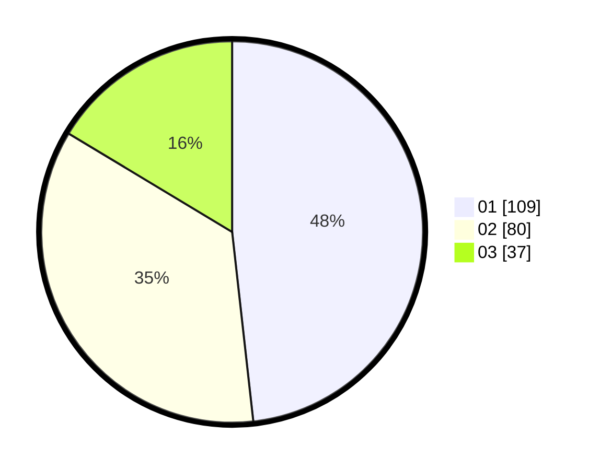

# Hasil

Hasil perolehan suara paslon dapat dilihat pada file paslon-01.txt, paslon-02.txt, dan paslon-03.txt.

Jika tidak ada, artinya data tersebut belum ada pada SIREKAP.

## Perolehan Suara

 * Paslon 01: **109**.
 * Paslon 02: **80**.
 * Paslon 03: **37**.

## Foto C Plano

https://sirekap-obj-formc.kpu.go.id/066a/pemilu/ppwp/31/73/08/10/05/3173081005060-20240214-224331--c2325f27-faa2-42e9-aafa-cbaafa4af00b.jpg

https://sirekap-obj-formc.kpu.go.id/066a/pemilu/ppwp/31/73/08/10/05/3173081005060-20240214-224446--049c6cd0-d504-491c-9ab3-1a8f4763a540.jpg

https://sirekap-obj-formc.kpu.go.id/066a/pemilu/ppwp/31/73/08/10/05/3173081005060-20240214-224550--20479d55-67c2-405b-bb94-014aff698cc7.jpg
