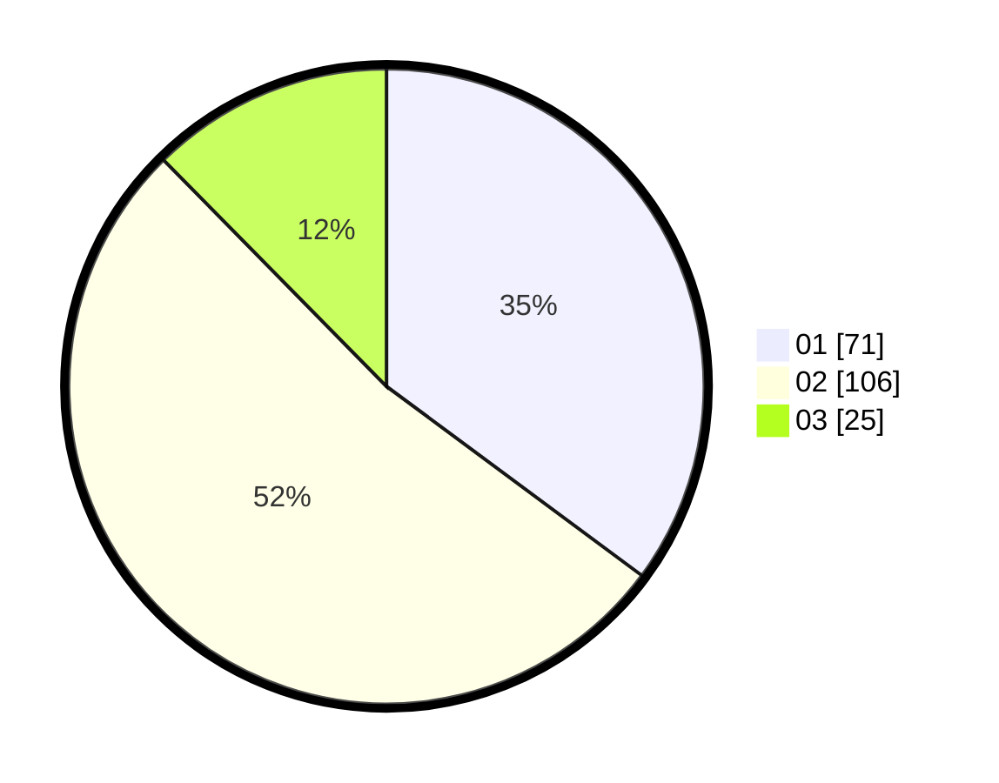

# Hasil

Hasil perolehan suara paslon dapat dilihat pada file paslon-01.txt, paslon-02.txt, dan paslon-03.txt.

Jika tidak ada, artinya data tersebut belum ada pada SIREKAP.

## Perolehan Suara

 * Paslon 01: **71**.
 * Paslon 02: **106**.
 * Paslon 03: **25**.

## Foto C Plano

https://sirekap-obj-formc.kpu.go.id/6a89/pemilu/ppwp/31/73/08/10/05/3173081005064-20240215-232820--55f6a9f6-c1a8-4d94-b957-248c3e57db84.jpg

https://sirekap-obj-formc.kpu.go.id/6a89/pemilu/ppwp/31/73/08/10/05/3173081005064-20240215-232823--80bf51ff-5c5f-472f-b711-ea2ab62f0d97.jpg

https://sirekap-obj-formc.kpu.go.id/6a89/pemilu/ppwp/31/73/08/10/05/3173081005064-20240215-232821--253d0e16-de28-405a-8c31-bda978da420d.jpg

## DATA PEMILIH TETAP

Jumlah pemilih dalam DPT: **204**.
 * L: **96**.
 * P: **108**.

## DATA PENGGUNA HAK PILIH

Jumlah pengguna hak pilih dalam DPT: **201**.
 * L: **96**.
 * P: **105**.

Jumlah pengguna hak pilih dalam DPTb: **2**.
 * L: **0**.
 * P: **2**.

Jumlah pengguna hak pilih dalam DPK: **1**.
 * L: **0**.
 * P: **1**.

Jumlah pengguna hak pilih: **204**.
 * L: **0**.
 * P: **0**.

## JUMLAH SUARA SAH DAN TIDAK SAH

JUMLAH SELURUH SUARA SAH: **202**.

JUMLAH SUARA TIDAK SAH: **2**.

JUMLAH SELURUH SUARA SAH DAN SUARA TIDAK SAH: **204**.
