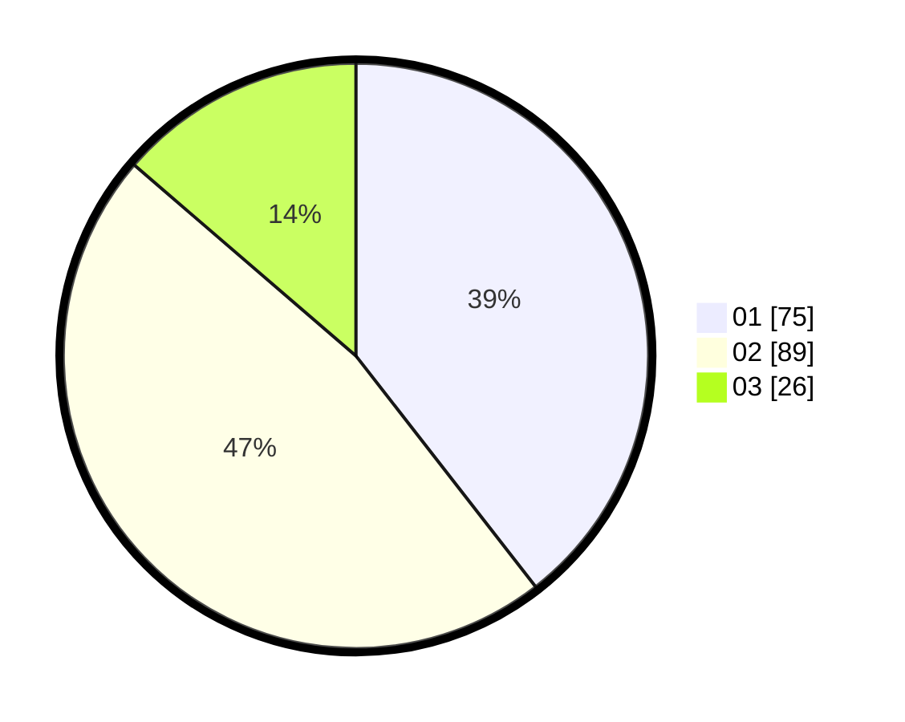

# Hasil

Hasil perolehan suara paslon dapat dilihat pada file paslon-01.txt, paslon-02.txt, dan paslon-03.txt.

Jika tidak ada, artinya data tersebut belum ada pada SIREKAP.

## Perolehan Suara

 * Paslon 01: **75**.
 * Paslon 02: **89**.
 * Paslon 03: **26**.

## Foto C Plano

https://sirekap-obj-formc.kpu.go.id/7d72/pemilu/ppwp/31/73/08/10/05/3173081005065-20240216-071920--5e16c3fd-0ca0-4d46-932d-dc51591d9c67.jpg

https://sirekap-obj-formc.kpu.go.id/7d72/pemilu/ppwp/31/73/08/10/05/3173081005065-20240216-071922--24df930c-ac3c-453a-a576-61d96f099f2e.jpg

https://sirekap-obj-formc.kpu.go.id/7d72/pemilu/ppwp/31/73/08/10/05/3173081005065-20240216-071921--19040451-1e56-4c17-9997-02c831e578a1.jpg

## DATA PEMILIH TETAP

Jumlah pemilih dalam DPT: **186**.
 * L: **84**.
 * P: **102**.

## DATA PENGGUNA HAK PILIH

Jumlah pengguna hak pilih dalam DPT: **186**.
 * L: **84**.
 * P: **102**.

Jumlah pengguna hak pilih dalam DPTb: **0**.
 * L: **0**.
 * P: **0**.

Jumlah pengguna hak pilih dalam DPK: **5**.
 * L: **2**.
 * P: **3**.

Jumlah pengguna hak pilih: **191**.
 * L: **86**.
 * P: **105**.

## JUMLAH SUARA SAH DAN TIDAK SAH

JUMLAH SELURUH SUARA SAH: **190**.

JUMLAH SUARA TIDAK SAH: **1**.

JUMLAH SELURUH SUARA SAH DAN SUARA TIDAK SAH: **191**.
