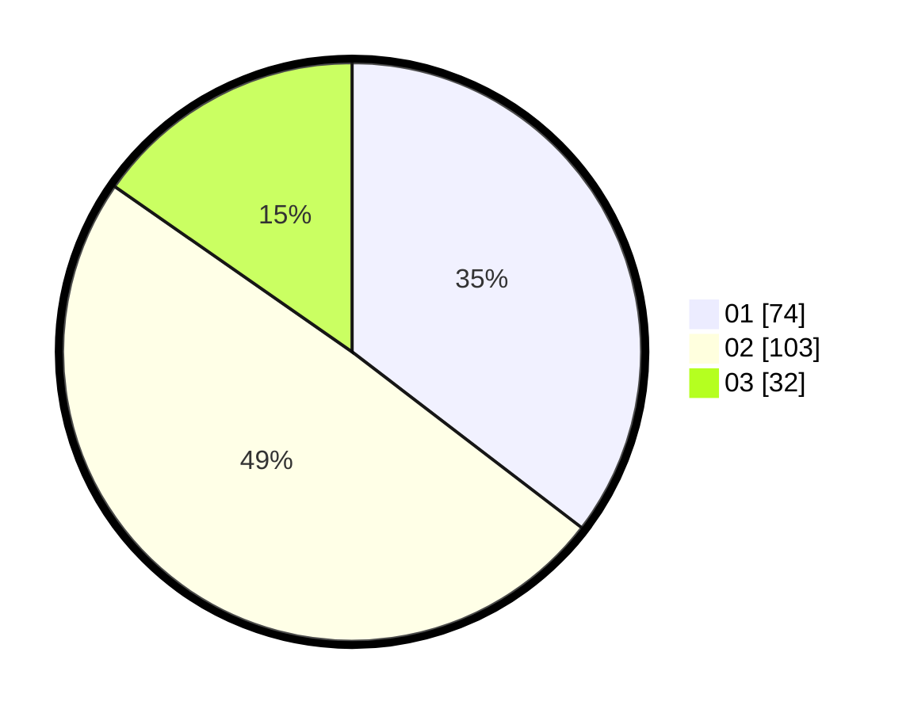

# Hasil

Hasil perolehan suara paslon dapat dilihat pada file paslon-01.txt, paslon-02.txt, dan paslon-03.txt.

Jika tidak ada, artinya data tersebut belum ada pada SIREKAP.

## Perolehan Suara

 * Paslon 01: **74**.
 * Paslon 02: **103**.
 * Paslon 03: **32**.

## Foto C Plano

https://sirekap-obj-formc.kpu.go.id/ea77/pemilu/ppwp/31/73/08/10/05/3173081005070-20240216-175917--c53686b8-f7ae-4f3a-bd86-7f5aa93dec92.jpg

https://sirekap-obj-formc.kpu.go.id/ea77/pemilu/ppwp/31/73/08/10/05/3173081005070-20240216-175918--1c345904-5d16-4170-b2e7-6775e0579a63.jpg

https://sirekap-obj-formc.kpu.go.id/ea77/pemilu/ppwp/31/73/08/10/05/3173081005070-20240216-175918--53edb81f-9255-4630-9f02-78cfd8ac6cf9.jpg

## DATA PEMILIH TETAP

Jumlah pemilih dalam DPT: **0**.
 * L: **0**.
 * P: **0**.

## DATA PENGGUNA HAK PILIH

Jumlah pengguna hak pilih dalam DPT: **0**.
 * L: **0**.
 * P: **0**.

Jumlah pengguna hak pilih dalam DPTb: **0**.
 * L: **0**.
 * P: **0**.

Jumlah pengguna hak pilih dalam DPK: **0**.
 * L: **0**.
 * P: **0**.

Jumlah pengguna hak pilih: **0**.
 * L: **0**.
 * P: **0**.

## JUMLAH SUARA SAH DAN TIDAK SAH

JUMLAH SELURUH SUARA SAH: **209**.

JUMLAH SUARA TIDAK SAH: **2**.

JUMLAH SELURUH SUARA SAH DAN SUARA TIDAK SAH: **211**.
