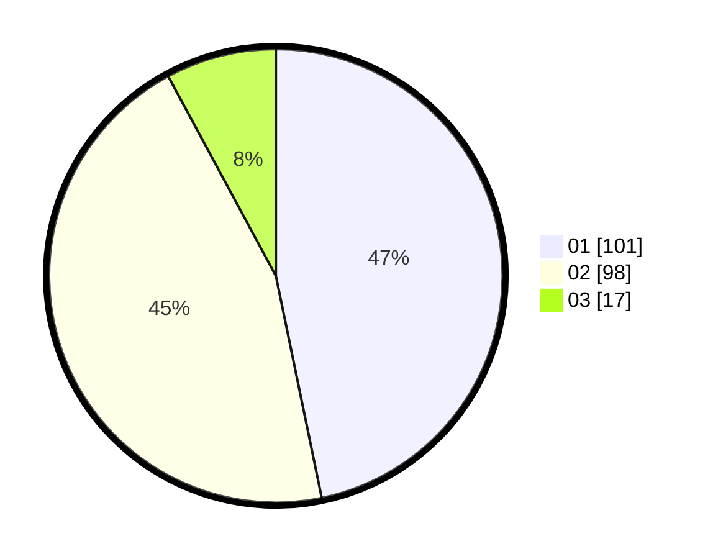

# Hasil

Hasil perolehan suara paslon dapat dilihat pada file paslon-01.txt, paslon-02.txt, dan paslon-03.txt.

Jika tidak ada, artinya data tersebut belum ada pada SIREKAP.

## Perolehan Suara

 * Paslon 01: **101**.
 * Paslon 02: **98**.
 * Paslon 03: **17**.

## Foto C Plano

https://sirekap-obj-formc.kpu.go.id/06ec/pemilu/ppwp/31/73/08/10/05/3173081005071-20240214-203023--b5c9086f-0200-459d-916a-9de655281139.jpg

https://sirekap-obj-formc.kpu.go.id/06ec/pemilu/ppwp/31/73/08/10/05/3173081005071-20240214-221353--41c8418b-ffda-4854-94dd-a9d4634f9b50.jpg

https://sirekap-obj-formc.kpu.go.id/06ec/pemilu/ppwp/31/73/08/10/05/3173081005071-20240214-192546--64129c6a-0a74-4e70-9d72-69b9a6c15bcd.jpg

## DATA PEMILIH TETAP

Jumlah pemilih dalam DPT: **277**.
 * L: **147**.
 * P: **130**.

## DATA PENGGUNA HAK PILIH

Jumlah pengguna hak pilih dalam DPT: **213**.
 * L: **103**.
 * P: **110**.

Jumlah pengguna hak pilih dalam DPTb: **0**.
 * L: **0**.
 * P: **0**.

Jumlah pengguna hak pilih dalam DPK: **4**.
 * L: **0**.
 * P: **4**.

Jumlah pengguna hak pilih: **217**.
 * L: **103**.
 * P: **114**.

## JUMLAH SUARA SAH DAN TIDAK SAH

JUMLAH SELURUH SUARA SAH: **216**.

JUMLAH SUARA TIDAK SAH: **1**.

JUMLAH SELURUH SUARA SAH DAN SUARA TIDAK SAH: **217**.
