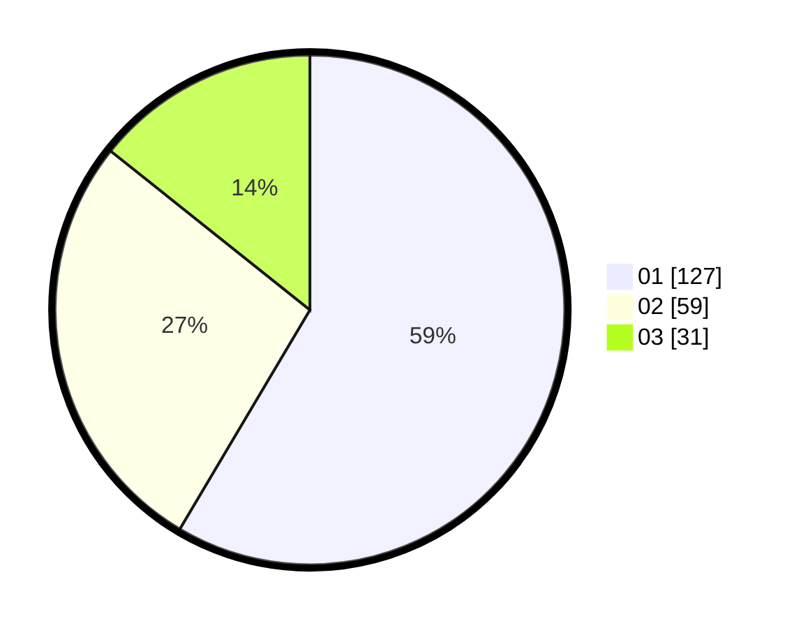

# Hasil

Hasil perolehan suara paslon dapat dilihat pada file paslon-01.txt, paslon-02.txt, dan paslon-03.txt.

Jika tidak ada, artinya data tersebut belum ada pada SIREKAP.

## Perolehan Suara

 * Paslon 01: **127**.
 * Paslon 02: **59**.
 * Paslon 03: **31**.

## Foto C Plano

https://sirekap-obj-formc.kpu.go.id/e02b/pemilu/ppwp/31/73/08/10/05/3173081005081-20240214-190109--a5e90677-f014-480b-bc4a-20ef3a4f57fc.jpg

https://sirekap-obj-formc.kpu.go.id/e02b/pemilu/ppwp/31/73/08/10/05/3173081005081-20240214-190342--4210309a-d3ce-4059-b3f9-0197f85484b3.jpg
