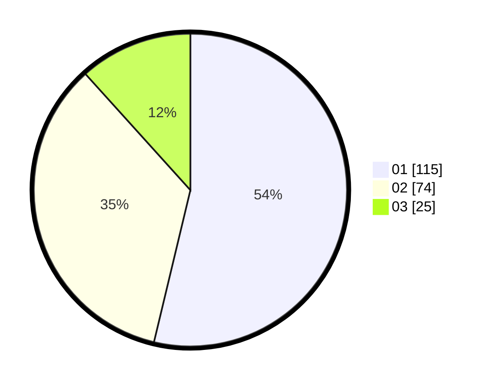

# Hasil

Hasil perolehan suara paslon dapat dilihat pada file paslon-01.txt, paslon-02.txt, dan paslon-03.txt.

Jika tidak ada, artinya data tersebut belum ada pada SIREKAP.

## Perolehan Suara

 * Paslon 01: **115**.
 * Paslon 02: **74**.
 * Paslon 03: **25**.

## Foto C Plano

https://sirekap-obj-formc.kpu.go.id/2811/pemilu/ppwp/31/73/08/10/05/3173081005082-20240214-155353--a2f1ac19-e9ce-482f-badb-b4909f298ab1.jpg

https://sirekap-obj-formc.kpu.go.id/2811/pemilu/ppwp/31/73/08/10/05/3173081005082-20240214-155404--a41910c8-1fe5-4f85-b6b0-8209a0e3dc7e.jpg

https://sirekap-obj-formc.kpu.go.id/2811/pemilu/ppwp/31/73/08/10/05/3173081005082-20240214-155408--51290509-0e8f-460c-88f3-5851fe59a712.jpg

## DATA PEMILIH TETAP

Jumlah pemilih dalam DPT: **265**.
 * L: **122**.
 * P: **143**.

## DATA PENGGUNA HAK PILIH

Jumlah pengguna hak pilih dalam DPT: **214**.
 * L: **97**.
 * P: **117**.

Jumlah pengguna hak pilih dalam DPTb: **1**.
 * L: **0**.
 * P: **1**.

Jumlah pengguna hak pilih dalam DPK: **2**.
 * L: **1**.
 * P: **1**.

Jumlah pengguna hak pilih: **217**.
 * L: **98**.
 * P: **119**.

## JUMLAH SUARA SAH DAN TIDAK SAH

JUMLAH SELURUH SUARA SAH: **214**.

JUMLAH SUARA TIDAK SAH: **3**.

JUMLAH SELURUH SUARA SAH DAN SUARA TIDAK SAH: **217**.
