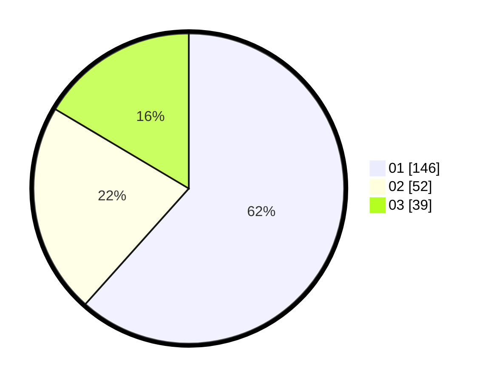

# Hasil

Hasil perolehan suara paslon dapat dilihat pada file paslon-01.txt, paslon-02.txt, dan paslon-03.txt.

Jika tidak ada, artinya data tersebut belum ada pada SIREKAP.

## Perolehan Suara

 * Paslon 01: **146**.
 * Paslon 02: **52**.
 * Paslon 03: **39**.

## Foto C Plano

https://sirekap-obj-formc.kpu.go.id/d7e5/pemilu/ppwp/31/73/08/10/05/3173081005083-20240214-205624--6c95000b-f9ba-4368-b0db-261a1ee9f051.jpg

https://sirekap-obj-formc.kpu.go.id/d7e5/pemilu/ppwp/31/73/08/10/05/3173081005083-20240214-202922--0e3ef56f-e2ac-4341-8b59-b07ddb0fada9.jpg
