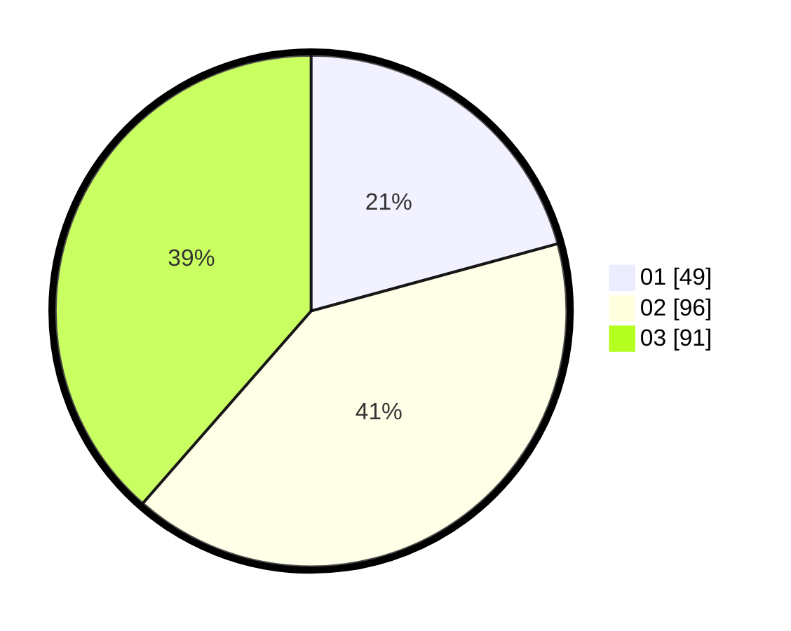

# Hasil

Hasil perolehan suara paslon dapat dilihat pada file paslon-01.txt, paslon-02.txt, dan paslon-03.txt.

Jika tidak ada, artinya data tersebut belum ada pada SIREKAP.

## Perolehan Suara

 * Paslon 01: **49**.
 * Paslon 02: **96**.
 * Paslon 03: **91**.

## Foto C Plano

https://sirekap-obj-formc.kpu.go.id/8ae2/pemilu/ppwp/31/73/08/10/05/3173081005087-20240214-193457--1cd6c341-7961-43e6-a5a3-6a94f09ac3a1.jpg

https://sirekap-obj-formc.kpu.go.id/8ae2/pemilu/ppwp/31/73/08/10/05/3173081005087-20240214-191346--8797863a-ce5e-4eeb-8e10-67b982bd0aba.jpg

https://sirekap-obj-formc.kpu.go.id/8ae2/pemilu/ppwp/31/73/08/10/05/3173081005087-20240214-191353--2ce0e747-6a96-4abf-8472-7b11deb3878b.jpg

## DATA PEMILIH TETAP

Jumlah pemilih dalam DPT: **288**.
 * L: **129**.
 * P: **159**.

## DATA PENGGUNA HAK PILIH

Jumlah pengguna hak pilih dalam DPT: **225**.
 * L: **100**.
 * P: **125**.

Jumlah pengguna hak pilih dalam DPTb: **11**.
 * L: **5**.
 * P: **6**.

Jumlah pengguna hak pilih dalam DPK: **3**.
 * L: **2**.
 * P: **1**.

Jumlah pengguna hak pilih: **239**.
 * L: **107**.
 * P: **132**.

## JUMLAH SUARA SAH DAN TIDAK SAH

JUMLAH SELURUH SUARA SAH: **236**.

JUMLAH SUARA TIDAK SAH: **3**.

JUMLAH SELURUH SUARA SAH DAN SUARA TIDAK SAH: **239**.
