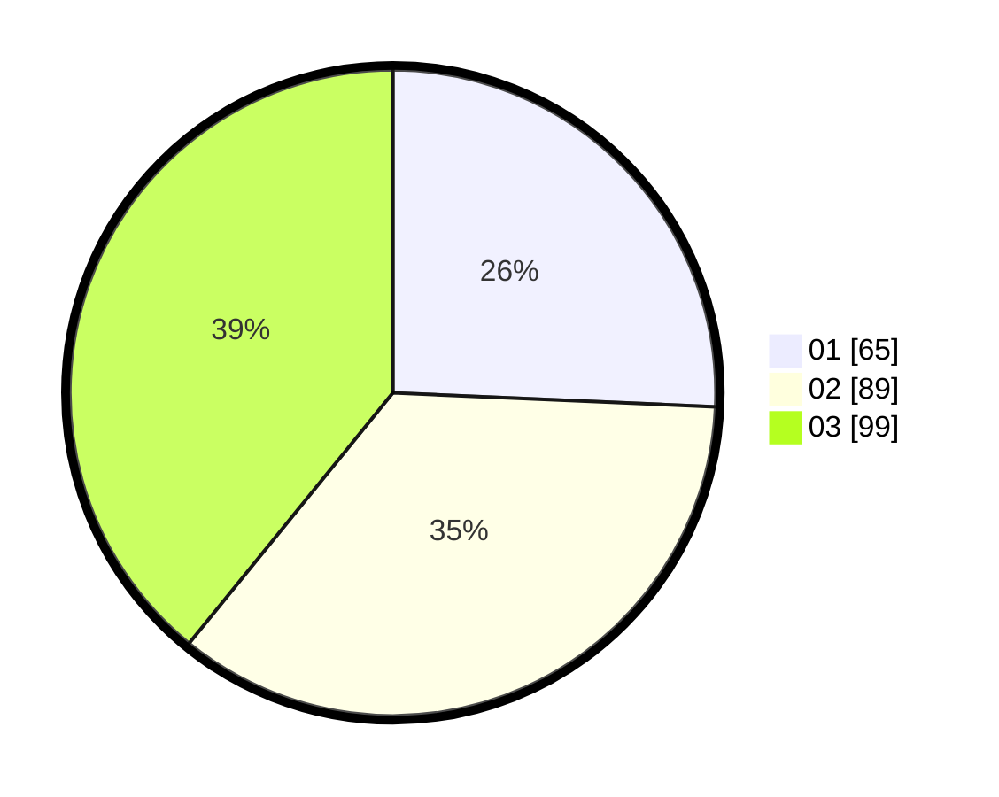

# Hasil

Hasil perolehan suara paslon dapat dilihat pada file paslon-01.txt, paslon-02.txt, dan paslon-03.txt.

Jika tidak ada, artinya data tersebut belum ada pada SIREKAP.

## Perolehan Suara

 * Paslon 01: **65**.
 * Paslon 02: **89**.
 * Paslon 03: **99**.

## Foto C Plano

https://sirekap-obj-formc.kpu.go.id/e2ad/pemilu/ppwp/31/73/08/10/05/3173081005089-20240214-155251--a1a6a565-406f-4ceb-8e88-7cc95c5f4c2e.jpg

https://sirekap-obj-formc.kpu.go.id/e2ad/pemilu/ppwp/31/73/08/10/05/3173081005089-20240214-155505--c73271ea-ccc0-417e-b3a4-c7b439794af4.jpg

https://sirekap-obj-formc.kpu.go.id/e2ad/pemilu/ppwp/31/73/08/10/05/3173081005089-20240214-155058--19a797b1-6087-4b93-9f61-63e856679e0c.jpg

## DATA PEMILIH TETAP

Jumlah pemilih dalam DPT: **291**.
 * L: **134**.
 * P: **157**.

## DATA PENGGUNA HAK PILIH

Jumlah pengguna hak pilih dalam DPT: **241**.
 * L: **110**.
 * P: **131**.

Jumlah pengguna hak pilih dalam DPTb: **7**.
 * L: **2**.
 * P: **5**.

Jumlah pengguna hak pilih dalam DPK: **7**.
 * L: **3**.
 * P: **4**.

Jumlah pengguna hak pilih: **255**.
 * L: **115**.
 * P: **140**.

## JUMLAH SUARA SAH DAN TIDAK SAH

JUMLAH SELURUH SUARA SAH: **253**.

JUMLAH SUARA TIDAK SAH: **2**.

JUMLAH SELURUH SUARA SAH DAN SUARA TIDAK SAH: **255**.
