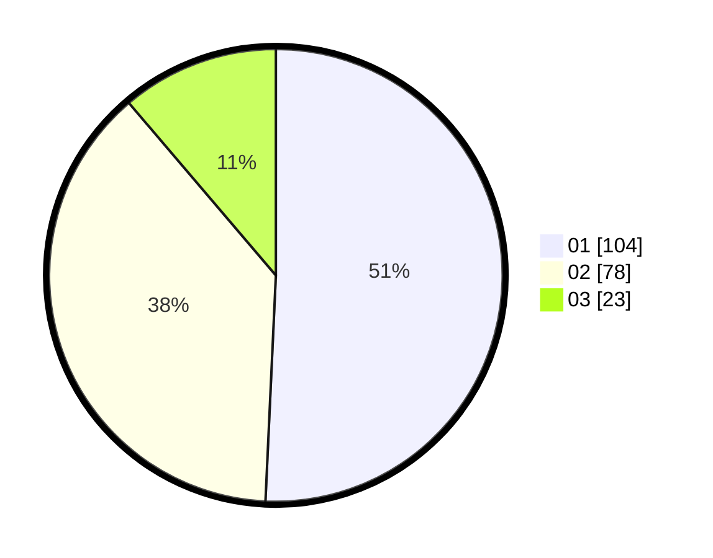

# Hasil

Hasil perolehan suara paslon dapat dilihat pada file paslon-01.txt, paslon-02.txt, dan paslon-03.txt.

Jika tidak ada, artinya data tersebut belum ada pada SIREKAP.

## Perolehan Suara

 * Paslon 01: **104**.
 * Paslon 02: **78**.
 * Paslon 03: **23**.

## Foto C Plano

https://sirekap-obj-formc.kpu.go.id/31be/pemilu/ppwp/31/73/08/10/05/3173081005092-20240214-192708--75af99c9-1e4e-444e-ab1f-c7e949789280.jpg

https://sirekap-obj-formc.kpu.go.id/31be/pemilu/ppwp/31/73/08/10/05/3173081005092-20240214-193042--ec5a83ba-ecfb-4d3a-a321-d5da4c6116c0.jpg

https://sirekap-obj-formc.kpu.go.id/31be/pemilu/ppwp/31/73/08/10/05/3173081005092-20240214-193207--7a15c01a-e50a-46ce-a061-be7f35fa49da.jpg
