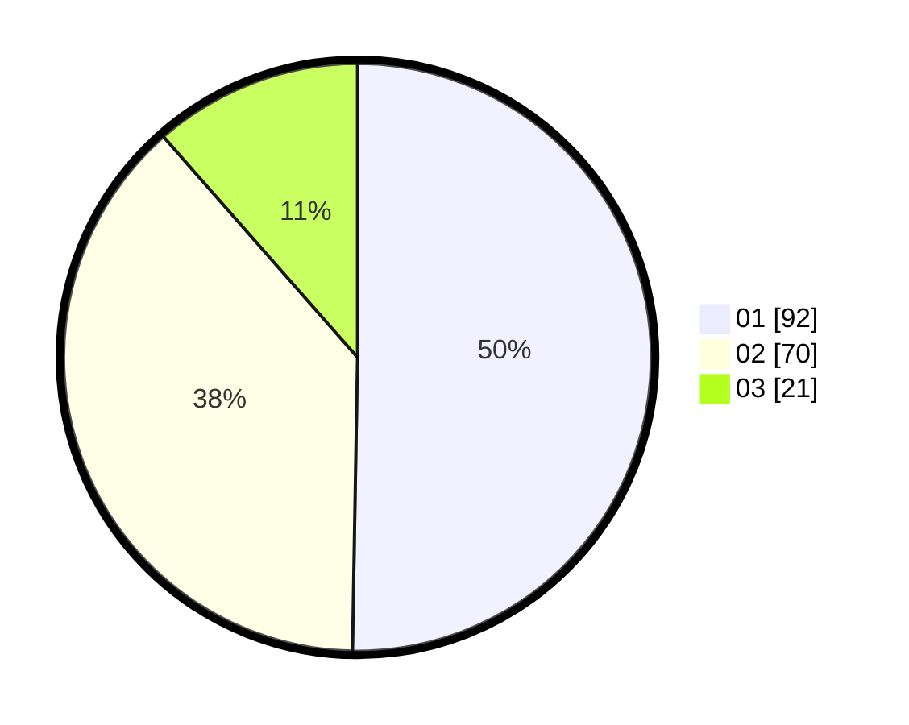

# Hasil

Hasil perolehan suara paslon dapat dilihat pada file paslon-01.txt, paslon-02.txt, dan paslon-03.txt.

Jika tidak ada, artinya data tersebut belum ada pada SIREKAP.

## Perolehan Suara

 * Paslon 01: **92**.
 * Paslon 02: **70**.
 * Paslon 03: **21**.

## Foto C Plano

https://sirekap-obj-formc.kpu.go.id/73f1/pemilu/ppwp/31/73/08/10/05/3173081005093-20240214-225233--9d7acf9c-b7db-4da5-982d-973281866379.jpg

https://sirekap-obj-formc.kpu.go.id/73f1/pemilu/ppwp/31/73/08/10/05/3173081005093-20240214-225416--a1049935-d4be-4310-bff9-a6610d5ecc5e.jpg

https://sirekap-obj-formc.kpu.go.id/73f1/pemilu/ppwp/31/73/08/10/05/3173081005093-20240214-225832--e4dba109-9a28-4a40-a093-9124ef81174c.jpg
