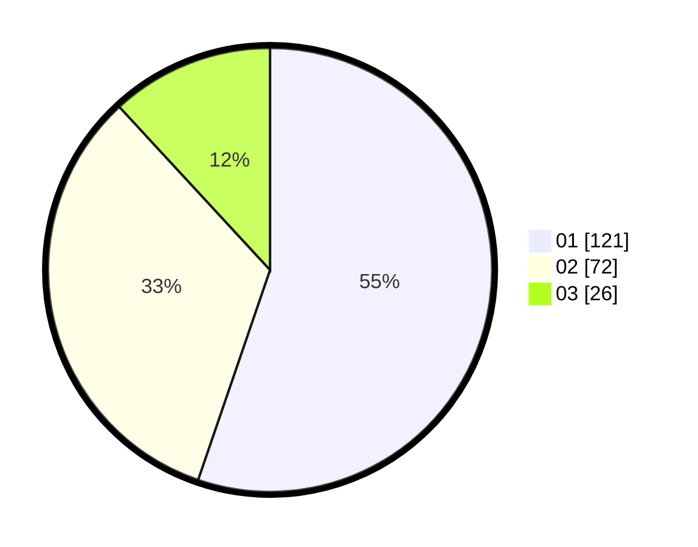

# Hasil

Hasil perolehan suara paslon dapat dilihat pada file paslon-01.txt, paslon-02.txt, dan paslon-03.txt.

Jika tidak ada, artinya data tersebut belum ada pada SIREKAP.

## Perolehan Suara

 * Paslon 01: **121**.
 * Paslon 02: **72**.
 * Paslon 03: **26**.

## Foto C Plano

https://sirekap-obj-formc.kpu.go.id/cde7/pemilu/ppwp/31/73/08/10/05/3173081005097-20240216-135620--f4bf182b-f677-4152-a311-2c09bd69242e.jpg

https://sirekap-obj-formc.kpu.go.id/cde7/pemilu/ppwp/31/73/08/10/05/3173081005097-20240216-135621--e9c021d1-ff45-4064-be25-39567de37148.jpg

https://sirekap-obj-formc.kpu.go.id/cde7/pemilu/ppwp/31/73/08/10/05/3173081005097-20240216-160316--c9df7ed7-5eab-49e7-a6c8-dc29a41e59fb.jpg

## DATA PEMILIH TETAP

Jumlah pemilih dalam DPT: **223**.
 * L: **116**.
 * P: **107**.

## DATA PENGGUNA HAK PILIH

Jumlah pengguna hak pilih dalam DPT: **220**.
 * L: **115**.
 * P: **105**.

Jumlah pengguna hak pilih dalam DPTb: **3**.
 * L: **1**.
 * P: **2**.

Jumlah pengguna hak pilih dalam DPK: **0**.
 * L: **0**.
 * P: **0**.

Jumlah pengguna hak pilih: **223**.
 * L: **116**.
 * P: **107**.

## JUMLAH SUARA SAH DAN TIDAK SAH

JUMLAH SELURUH SUARA SAH: **0**.

JUMLAH SUARA TIDAK SAH: **0**.

JUMLAH SELURUH SUARA SAH DAN SUARA TIDAK SAH: **0**.
