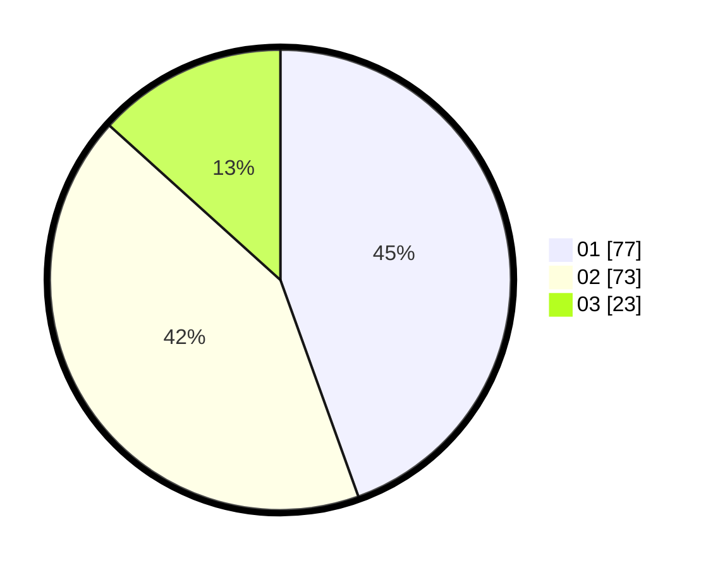

# Hasil

Hasil perolehan suara paslon dapat dilihat pada file paslon-01.txt, paslon-02.txt, dan paslon-03.txt.

Jika tidak ada, artinya data tersebut belum ada pada SIREKAP.

## Perolehan Suara

 * Paslon 01: **77**.
 * Paslon 02: **73**.
 * Paslon 03: **23**.

## Foto C Plano

https://sirekap-obj-formc.kpu.go.id/f5f3/pemilu/ppwp/31/73/08/10/05/3173081005103-20240214-200853--b408e1fe-0374-498c-b5f6-c8679753b8bc.jpg

https://sirekap-obj-formc.kpu.go.id/f5f3/pemilu/ppwp/31/73/08/10/05/3173081005103-20240214-195249--74becc4d-e612-4045-a6ef-892fecde7a58.jpg

https://sirekap-obj-formc.kpu.go.id/f5f3/pemilu/ppwp/31/73/08/10/05/3173081005103-20240214-195229--e56fbc93-fa1b-44b9-8d0f-53a75abfa4f3.jpg
