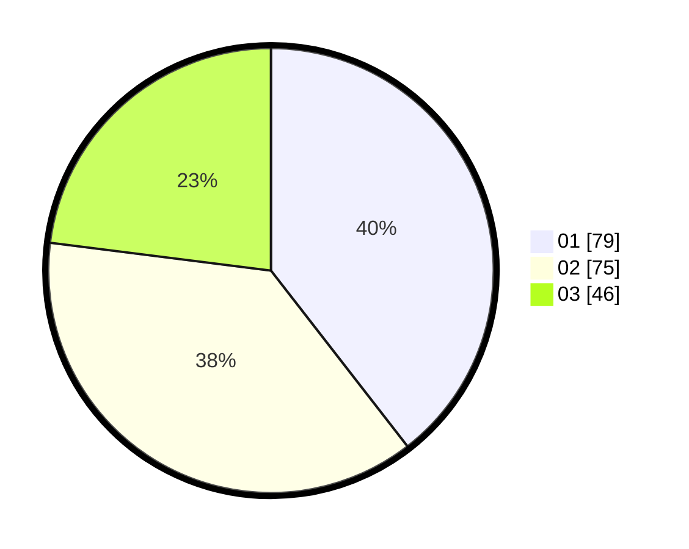

# Hasil

Hasil perolehan suara paslon dapat dilihat pada file paslon-01.txt, paslon-02.txt, dan paslon-03.txt.

Jika tidak ada, artinya data tersebut belum ada pada SIREKAP.

## Perolehan Suara

 * Paslon 01: **79**.
 * Paslon 02: **75**.
 * Paslon 03: **46**.

## Foto C Plano

https://sirekap-obj-formc.kpu.go.id/517a/pemilu/ppwp/31/73/08/10/05/3173081005108-20240214-220949--848d3ff8-de09-4a28-8a2f-40c7047fae90.jpg

https://sirekap-obj-formc.kpu.go.id/517a/pemilu/ppwp/31/73/08/10/05/3173081005108-20240214-221003--b83abf51-1695-404a-b947-b38210b101c8.jpg

https://sirekap-obj-formc.kpu.go.id/517a/pemilu/ppwp/31/73/08/10/05/3173081005108-20240214-221643--e7e93de3-7eec-4b6b-a14f-5b3992828ed9.jpg

## DATA PEMILIH TETAP

Jumlah pemilih dalam DPT: **267**.
 * L: **125**.
 * P: **142**.

## DATA PENGGUNA HAK PILIH

Jumlah pengguna hak pilih dalam DPT: **203**.
 * L: **93**.
 * P: **108**.

Jumlah pengguna hak pilih dalam DPTb: **0**.
 * L: **0**.
 * P: **0**.

Jumlah pengguna hak pilih dalam DPK: **2**.
 * L: **0**.
 * P: **2**.

Jumlah pengguna hak pilih: **203**.
 * L: **93**.
 * P: **110**.

## JUMLAH SUARA SAH DAN TIDAK SAH

JUMLAH SELURUH SUARA SAH: **200**.

JUMLAH SUARA TIDAK SAH: **3**.

JUMLAH SELURUH SUARA SAH DAN SUARA TIDAK SAH: **203**.
