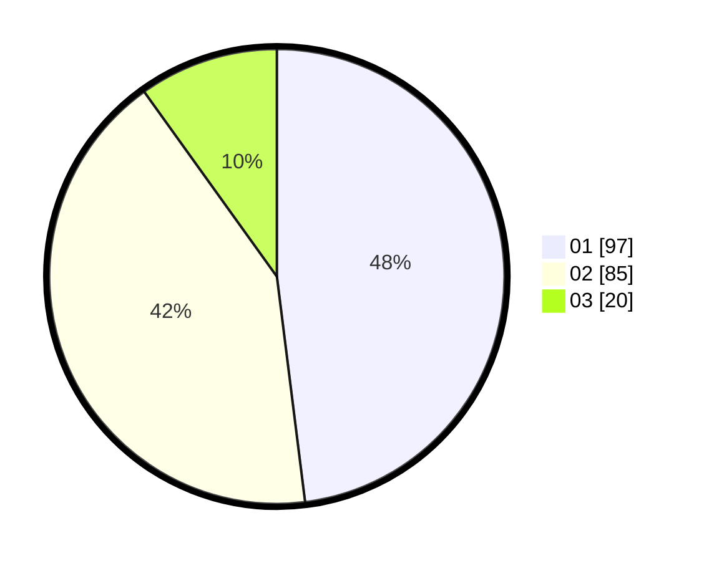

# Hasil

Hasil perolehan suara paslon dapat dilihat pada file paslon-01.txt, paslon-02.txt, dan paslon-03.txt.

Jika tidak ada, artinya data tersebut belum ada pada SIREKAP.

## Perolehan Suara

 * Paslon 01: **97**.
 * Paslon 02: **85**.
 * Paslon 03: **20**.

## Foto C Plano

https://sirekap-obj-formc.kpu.go.id/0bf5/pemilu/ppwp/31/73/08/10/05/3173081005110-20240214-191235--bc5d03b2-5be3-42a3-8f18-e3777cdfb705.jpg

https://sirekap-obj-formc.kpu.go.id/0bf5/pemilu/ppwp/31/73/08/10/05/3173081005110-20240214-190512--273b6e78-e0ed-4c74-a34d-6a565f0d9a0b.jpg

https://sirekap-obj-formc.kpu.go.id/0bf5/pemilu/ppwp/31/73/08/10/05/3173081005110-20240214-190604--0f73cca8-2fb9-448b-b382-188e0075b7ca.jpg

## DATA PEMILIH TETAP

Jumlah pemilih dalam DPT: **268**.
 * L: **140**.
 * P: **128**.

## DATA PENGGUNA HAK PILIH

Jumlah pengguna hak pilih dalam DPT: **268**.
 * L: **140**.
 * P: **128**.

Jumlah pengguna hak pilih dalam DPTb: **6**.
 * L: **5**.
 * P: **1**.

Jumlah pengguna hak pilih dalam DPK: **0**.
 * L: **0**.
 * P: **0**.

Jumlah pengguna hak pilih: **274**.
 * L: **145**.
 * P: **129**.

## JUMLAH SUARA SAH DAN TIDAK SAH

JUMLAH SELURUH SUARA SAH: **202**.

JUMLAH SUARA TIDAK SAH: **4**.

JUMLAH SELURUH SUARA SAH DAN SUARA TIDAK SAH: **206**.
